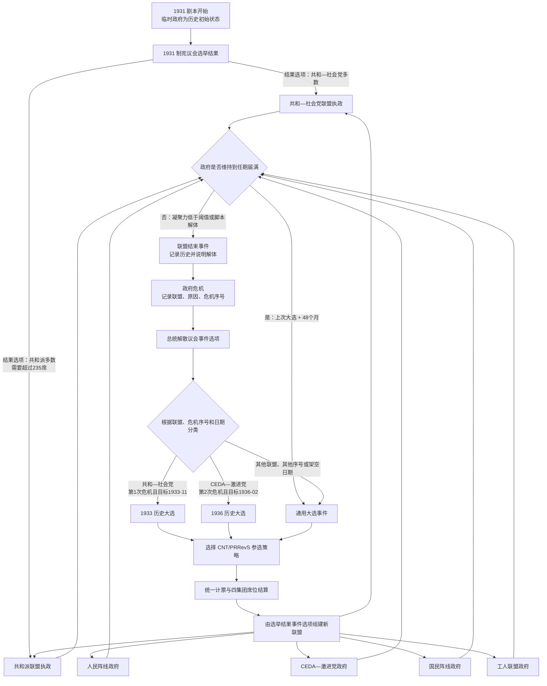
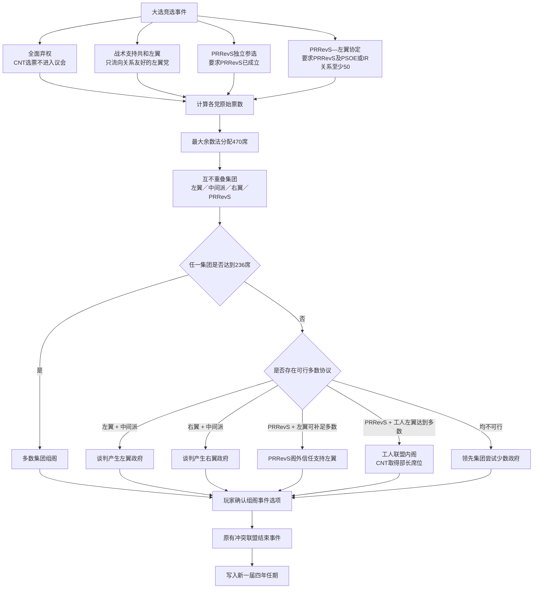

# Liberty Unquenched Architecture

> 当前架构的事实来源，而不是迁移过程日志。
>
> - 架构状态：核心迁移完成，工程收口尚未全部完成。
> - 最后验证日期：2026-09-20。
> - 验证基线：`npm run verify:phase5` 与 `npm run build --prefix editor` 均通过。
> - 历史背景：[ARCHITECTURE_MIGRATION_PLAN.md](./ARCHITECTURE_MIGRATION_PLAN.md)。

本文面向开发者和 AI。目标是让架构结论能够从源码和测试中复核，并为后续修改提供稳定的导航、依赖规则和验收标准。

<a id="contents"></a>
## 导航

1. [重构完成度](#status)
2. [一分钟架构地图](#map)
3. [模块职责与事实来源](#modules)
4. [状态与写入模型](#state)
5. [主要运行时调用链](#flows)
6. [UI 与 selector 边界](#ui)
7. [卡牌、事件与运行时注册表](#registries)
8. [地图与战争边界](#map-boundary)
9. [场景初始化](#scenarios)
10. [存档与兼容迁移](#persistence)
11. [必须保持的架构不变量](#invariants)
12. [常见开发任务](#playbooks)
13. [验证矩阵](#verification)
14. [已知债务与下一阶段](#debt)
15. [文档维护协议](#maintenance)

<a id="status"></a>
## 1. 重构完成度

### 结论

架构的主体迁移已经完成，可以在当前边界上继续开发业务功能；整个架构重构计划尚未完全收口。

两者的区别如下：

| 范围 | 状态 | 证据 |
| --- | --- | --- |
| UI 与内容层解除 `GameContext` 耦合 | 完成 | `test:architecture`、`test:selectors` |
| 根 reducer、月度编排、战斗与 AI 规则提取 | 完成 | `test:architecture`、`test:orchestration` |
| 单一 `GameState` 与地图运行时边界 | 完成 | `test:architecture`、战争测试 |
| 卡牌、调度事件、存档恢复注册表分离 | 完成 | `test:registries` |
| 迁移脚手架、旧 barrel、旧状态模型和高置信度死代码清理 | 完成 | `test:architecture`、`noUnusedLocals` |
| 编译器全面严格化 | 未完成 | 尚未启用 `strict`、`noUnusedParameters` |
| 当前命名的单一聚合验收命令 | 未完成 | 仍沿用历史名称 `verify:phase5` |
| 完整回归套件进入 CI | 未完成 | CI 当前只执行 `lint` 和主构建 |
| 前端按真实边界拆包 | 未完成 | Vite 仍报告主 bundle 大于 500 kB |
| `GameAction` 路由完整性 | 有已知缺口 | `UPDATE_TAX_DRAFT` 未从根 reducer 路由到 economy reducer |

因此，后续不应重新设计状态容器、注册表或 selector 架构；应优先完成 [Phase 7 工程收口](#debt)，并在现有边界内迭代内容。

当前明确的行为缺口是：[`fiscal_policy.tsx`](../src/game/government_affairs/fiscal_policy.tsx) 会 dispatch `UPDATE_TAX_DRAFT`，[`economyReducer.ts`](../src/game/reducers/economyReducer.ts) 也实现了该分支，但 [`gameReducer.ts`](../src/game/reducers/gameReducer.ts) 尚未把此 action 路由给 economy reducer。完整测试仍通过，说明当前验证矩阵还缺少“每个生产 action 都能到达处理器”的覆盖。本文记录事实；修复时应同时增加 action-routing 回归测试。

### 当前验证快照

最近一次完整验证报告：

- 209 个源文件通过 TypeScript 与联盟权限审计。
- 173 个 `src/game` 源文件通过架构边界扫描。
- 26 张卡牌、57 个可调度事件、130 个可恢复事件通过注册表检查。
- 场景一致性、存档、selector、月度编排、效果预览、经济、战争、May Days 和工会占比测试通过。
- 主应用和本地 editor 均构建成功。

这些数量只是当前快照。真实约束由测试和显式注册表定义，不能把本文中的数字当成硬编码目标。

[返回导航](#contents)

<a id="map"></a>
## 2. 一分钟架构地图

### 依赖方向

```text
main.tsx
  -> App.tsx
    -> React components
      -> useGameSelector / useGameActions
        -> stable external store in GameContext.tsx
          -> gameReducer
            -> domain reducers OR phaseOrchestrator
              -> pure/domain rules
            -> postReducer invariant pipeline
              -> endings + achievements

content definitions
  -> domain types + pure rules + shared effect helpers
  -> explicit registries
    -> deck/card runtime
    -> monthly event scheduler
    -> save hydration

GameState
  -> extends MapRuntimeState
  -> selected as a narrow map read model
    -> MapView / Sidebar / map AI
```

### 关键判断

- 应用是纯客户端 React 应用，没有项目专用后端或远程业务 API。
- 全局运行时只有一个规范状态模型：`GameState`。
- UI 通过 selector 读取，通过 `GameAction` 写入；没有并行状态管理框架。
- 卡牌与事件是带函数的 TypeScript 内容定义，不是 JSON 配置。
- 存档不能保存函数，因此只保存内容 ID 和 JSON 数据，加载时用注册表恢复函数。
- `GameContext.tsx` 只负责 store、订阅、自动存档和读档接线，不承载游戏规则。
- 月度逻辑的顺序是业务语义，集中在 `phaseOrchestrator.ts`，不能随意重排。
- `GameEvent.meta` 只服务 editor 和内容审计，不参与主游戏调度。

[返回导航](#contents)

<a id="modules"></a>
## 3. 模块职责与事实来源

### 模块索引

| 模块 | 职责 | 主要入口 |
| --- | --- | --- |
| 启动层 | 创建 React 根节点和 Provider | [`src/main.tsx`](../src/main.tsx)、[`src/App.tsx`](../src/App.tsx) |
| UI | 展示 read model、发送 action，不拥有业务状态 | [`src/components`](../src/components)、[`src/map`](../src/map) |
| Store 接线 | 稳定 store、订阅、dispatch、自动存档、读档入口 | [`src/game/GameContext.tsx`](../src/game/GameContext.tsx) |
| 规范领域模型 | `GameState`、卡牌、事件、组织、法律等契约 | [`src/game/types.ts`](../src/game/types.ts) |
| UI read model | selector、view model、相等性边界 | [`src/game/selectors.ts`](../src/game/selectors.ts) |
| 根状态转换 | action 路由和统一后处理漏斗 | [`src/game/reducers/gameReducer.ts`](../src/game/reducers/gameReducer.ts) |
| 领域 reducer | 事件、经济、政治、地图、存档状态转换 | [`src/game/reducers`](../src/game/reducers) |
| 规则层 | 纯计算、月度管线、战争、联盟和政策规则 | [`src/game/rules`](../src/game/rules) |
| 内容层 | 卡牌、事件、顾问和日志定义 | [`src/game/action_affairs`](../src/game/action_affairs)、[`government_affairs`](../src/game/government_affairs)、[`military_affairs`](../src/game/military_affairs)、[`events`](../src/game/events)、[`advisors`](../src/game/advisors)、[`journal`](../src/game/journal) |
| 运行时注册表 | 卡牌发现、事件调度、存档恢复 | [`src/game/registries`](../src/game/registries) |
| 场景 | 规范基础状态和 1931/1933/1936 差异 | [`src/game/scenarios`](../src/game/scenarios) |
| 持久化 | JSON 序列化、localStorage、回调恢复、旧档迁移 | [`src/game/saveGame.ts`](../src/game/saveGame.ts)、[`saveMigrations.ts`](../src/game/saveMigrations.ts) |
| 地图模型 | 地图叶类型、常量、AI、视图和地图规则 | [`src/map`](../src/map) |
| 共享业务 helper | 阶级支持、派系影响、选举、联盟、零和份额 | [`src/game/utils`](../src/game/utils)、[`src/game/utils.ts`](../src/game/utils.ts) |
| 验证 | 架构守卫和领域回归脚本 | [`scripts`](../scripts) |
| 本地 editor | 内容编辑、流程工作台和测试台；不进入主运行时 | `editor/`，该目录本地维护并被 Git 忽略 |

### 仓库目录导航

```text
.
├─ .github/workflows/        # GitHub Pages 构建与部署
├─ docs/                     # 游戏设计、当前架构与迁移历史
├─ public/                   # 地图数据、图片、图标和音乐等静态资源
├─ scripts/                  # 架构守卫、领域回归与审计脚本
├─ src/
│  ├─ components/            # React UI 与模态窗口
│  ├─ game/                  # 规范状态、reducer、规则、内容和持久化
│  │  ├─ action_affairs/     # 行动卡牌
│  │  ├─ advisors/           # 顾问定义
│  │  ├─ events/             # 历史事件与事件链
│  │  ├─ government_affairs/ # 政府卡牌
│  │  ├─ journal/            # 长期日志
│  │  ├─ military_affairs/   # 军事卡牌
│  │  ├─ reducers/           # 领域状态转换
│  │  ├─ registries/         # 卡牌、事件调度与恢复注册表
│  │  ├─ rules/              # 纯规则与月度编排
│  │  └─ scenarios/          # 场景定义与初始化差异
│  ├─ lib/                   # 可复用的底层 UI/可视化工具
│  └─ map/                   # 地图模型、规则、AI 与地图 UI
├─ index.html                # Vite HTML 入口
├─ package.json              # npm 脚本与依赖
├─ tsconfig.json             # TypeScript 编译边界
└─ vite.config.ts            # 构建和 GitHub Pages 基础路径
```

本地 `editor/` 是独立工具工程，按当前仓库策略被 Git 忽略；它不是 `src/` 的运行时依赖。根目录中的构建配置只服务主应用，editor 使用自己的依赖和构建入口。

### 规范事实来源

同一概念不得在别处创建第二份定义。

| 概念 | 规范来源 | 不应重新引入的替代物 |
| --- | --- | --- |
| 完整应用状态 | `GameState` in [`types.ts`](../src/game/types.ts) | 第二个 `GameState`、UI 专用完整状态 |
| 地图最小运行时状态 | `MapRuntimeState` in [`types_map.ts`](../src/map/types_map.ts) | `AiPlanningState`、别名化 map state |
| 法律定义 | `LAW_DEFINITIONS` / `LAW_DEFINITION_BY_ID` in [`policyDefinitions.ts`](../src/game/rules/policyDefinitions.ts) | `POLICY_DEFINITIONS` 兼容别名 |
| 组织定义 | `ORGANIZATION_DEFINITIONS` in [`organizations.ts`](../src/game/organizations.ts) | 卡牌内自建组织 schema |
| 民兵/部队资源池 | `armedForces.entityPools` | `armedForces.militias`、`militiaManpower` |
| 工会占比 | [`unions.ts`](../src/game/unions.ts) | 组件或卡牌内自行归一化 |
| 卡牌目录 | `CARD_REGISTRY` | 广义 `data.ts` |
| 月度可发现事件 | `SCHEDULED_EVENT_REGISTRY` | `events/index.ts` 或按目录自动调度 |
| 存档可恢复事件 | `RESTORABLE_EVENT_REGISTRY` | 复用调度目录代替恢复目录 |
| 场景差异 | `ScenarioDefinition` + `SCENARIOS` | reducer 内的场景三元表达式 |
| 旧数据兼容 | `saveMigrations.ts` | 在运行时类型中永久保留旧字段 |

[返回导航](#contents)

<a id="state"></a>
## 4. 状态与写入模型

### 单一状态模型

[`GameState`](../src/game/types.ts) 是应用唯一完整状态。它包含政治、经济、内容流程、存档运行时引用和战争状态，并直接扩展 [`MapRuntimeState`](../src/map/types_map.ts)。这是有意采用的单状态聚合，不代表每个模块可以任意写入所有字段。

当前没有 Redux、Zustand 或 service container。状态由 [`createGameStore`](../src/game/GameContext.tsx) 持有，通过 `useSyncExternalStore` 发布快照。

### 写入漏斗

```text
UI interaction
  -> GameAction
  -> gameReducer
  -> owning domain reducer / advancePhase
  -> applyPostReducerPipeline
  -> new store snapshot
  -> selectors notify affected UI
```

写入规则：

1. UI 不直接修改状态，只发送 [`GameAction`](../src/game/reducers/types.ts)。
2. 普通卡牌和事件 option 返回 `Partial<GameState>`，由 event reducer 合并。
3. 月度变化必须进入 `advancePhase` 或它调用的规则管线。
4. 地图交互必须进入 map reducer；不得在组件内完成战斗或资源结算。
5. 每个根 action 最后都经过 [`applyPostReducerPipeline`](../src/game/reducers/postReducer.ts)。
6. `SANDBOX_EDIT` 是显式调试例外，而且只对 sandbox 难度生效。

### reducer 所有权

| reducer | 所有 action / 职责 |
| --- | --- |
| `eventReducer` | 卡牌、事件、顾问、抽牌、事件检查与内容回调 hydration |
| `economyReducer` | 税率草稿、税率提交和 sandbox 主权经济操作；`UPDATE_TAX_DRAFT` 的根路由目前是已知缺口 |
| `politicalReducer` | 语言、区域状态、sandbox 编辑、调试结局 |
| `mapReducer` | 地图选择、移动、回合、征募、增援、合并、拆分、解散和建筑 |
| `saveReducer` | 回到开始界面和已反序列化状态的运行时重接线 |
| `gameReducer` | action 到领域 reducer 的唯一顶层路由、场景开始、阶段推进、统一后处理 |

### 统一后处理所有权

[`postReducer.ts`](../src/game/reducers/postReducer.ts) 是状态不变量的最终所有者，负责：

- 法律等级、统计值、关系、派系影响与异议度的范围归一化；
- 治安力量派生状态；
- `civilWarStatus`、`wars` 和 `activeWar` 同步；
- 工会份额归一化；
- 党派支持度、联盟和政府危机派生；
- 共和国危机、政变里程碑和紧张度；
- 单调历史标记；
- 结局与成就检查。

领域 reducer 返回的结果不是最终状态。绕过 `gameReducer` 会同时绕过这些不变量。

[返回导航](#contents)

<a id="flows"></a>
## 5. 主要运行时调用链

### 5.1 启动与新游戏

```text
main.tsx
  -> App
  -> GameProvider
  -> PRE_START_STATE
  -> START_GAME
  -> createScenarioState
  -> initializeStartingCoalition
  -> postReducer
```

新游戏的唯一构造入口是 [`createScenarioState`](../src/game/scenarios/index.ts)。不要在 `StartScreen` 或 reducer 中复制场景初始化逻辑。

### 5.2 卡牌与事件

```text
CARD_REGISTRY
  -> hand/deck
  -> PLAY_CARD
  -> card.effect(state)
  -> currentEvent
  -> selectEventModalViewModel
  -> RESOLVE_EVENT(option.effect)
  -> eventReducer merges Partial<GameState>
  -> postReducer
```

事件条件、动态文本和预览在 selector/read-model 边界求值。自定义 `renderContent` 通过参数接收 `state` 和窄化的 `GameEventDispatch`，不得导入 `GameContext`。

### 5.3 月度与阶段推进

[`advancePhase`](../src/game/rules/phaseOrchestrator.ts) 是阶段和月度顺序的唯一编排点。

```text
NEXT_PHASE
  -> mandatory-event guards
  -> event -> action, or action -> war
  -> otherwise advance calendar month
  -> discard hand and calculate ordinary income
  -> international brigades / historical civil-war gate
  -> monthly map stage
  -> national economy
  -> policy effects
  -> economic-political feedback
  -> organization effects
  -> worker-control drift
  -> journal active effects and outcomes
  -> political / coalition maintenance
  -> scheduled event queue
  -> timers, hand and phase settlement
  -> war outcome check
  -> postReducer
```

此顺序会改变事件能观察到的状态以及同月效果叠加方式。修改顺序时必须更新 `test:orchestration`，并运行战争、May Days、rules 和 scenario parity 测试。

### 5.4 地图操作

```text
selectMapRuntimeState
  -> useMapRuntimeState
  -> MapView / Sidebar
  -> map GameAction
  -> mapReducer
  -> MAP_RUNTIME_HELPERS
     -> combat / AI turn / war status
  -> postReducer
```

### 5.5 存档加载

```text
localStorage snapshot
  -> shape/version check
  -> migrateSaveState
  -> restore cards/advisors by id
  -> build event catalog
  -> restore event callbacks by id
  -> normalize organizations/unions/wartime state
  -> LOAD_STATE
  -> saveReducer hydration
  -> postReducer
```

[返回导航](#contents)

<a id="ui"></a>
## 6. UI 与 selector 边界

### 公开读取和写入接口

[`GameContext.tsx`](../src/game/GameContext.tsx) 对 UI 提供：

- `useGameSelector(selector, equality)`：订阅最小稳定 read model；
- `useGameActions()`：只取得 `dispatch` 和 `loadSave`；
- `useMapRuntimeState()`：地图专用边界；
- `useGameSnapshotWhen(active)`：受审计的完整快照例外；
- `shallowEqual`：小型对象 selector 的相等性工具。

已经删除的 `useGame()` 不得恢复。

### selector 原则

1. 简单字段直接选择。
2. 跨字段展示使用 [`selectors.ts`](../src/game/selectors.ts) 中命名的 view model。
3. selector 必须有生产消费者；禁止为 API 对称性添加未使用 selector。
4. 返回宽状态对象时必须配套明确的字段相等性函数。
5. 条件、动态标题和动态 option 应在 view model 中求值，避免组件持有完整状态。

### 完整快照允许列表

完整 `GameState` 快照当前只允许出现在：

- `MainArea.tsx`：已挂载的自定义事件渲染；
- `SandboxMenu.tsx`：已打开的 sandbox 编辑器；
- `SaveManagerModal.tsx`：已打开的存档界面。

该允许列表由 `test:architecture` 逐文件断言。新增完整快照消费者需要明确理由、更新架构测试和本文；默认方案应是新增 read model。

[返回导航](#contents)

<a id="registries"></a>
## 7. 卡牌、事件与运行时注册表

### 三个注册表不能合并

| 注册表 | 内容 | 消费者 |
| --- | --- | --- |
| [`CARD_REGISTRY`](../src/game/registries/cardRegistry.ts) | 行动、政府、军事卡牌 | 场景牌组、出牌、存档卡牌恢复 |
| [`SCHEDULED_EVENT_REGISTRY`](../src/game/registries/scheduledEventRegistry.ts) | 能被开始/月度调度发现的 `solo` 或 `inline.root` 事件 | 场景开始事件、月度事件队列 |
| [`RESTORABLE_EVENT_REGISTRY`](../src/game/registries/restorableEventRegistry.ts) | 所有需要从存档恢复回调的 root/node/leaf | 存档反序列化、运行时 hydration |

分离原因：链中间节点需要恢复，但不能被月度调度器直接发现。把恢复目录和调度目录合并会产生随机跳入事件链中部的风险。

### ID 和元数据规则

- `Card.id`、`GameEvent.id`、`Advisor.id` 是持久化身份，发布后不得随意修改。
- 同一注册表内 ID 必须唯一。
- 同一个事件 ID 在调度和恢复注册表中必须引用同一个定义对象。
- `GameEvent.meta.flow` 用于 editor 分类和审计；主运行时使用显式注册表，不根据 `meta` 自动注册或触发。
- `inline.node` 和 `inline.leaf` 只能通过事件链进入，不得加入调度注册表。
- 每个导出的 `GameEvent` 都必须能在恢复注册表找到。

### 内容层依赖规则

内容文件可以依赖：

- `types.ts` 中的领域契约；
- 纯规则；
- `utils`、`unions`、`organizations`、`lawStances` 等共享业务 helper；
- 自定义事件需要的纯展示组件。

内容文件不得依赖：

- `GameContext`；
- 根 reducer；
- store 初始化；
- 通过目录扫描进行主运行时自动注册的隐式机制。

[返回导航](#contents)

<a id="map-boundary"></a>
## 8. 地图与战争边界

[`src/map/types_map.ts`](../src/map/types_map.ts) 是叶类型模块，不能导入 `src/game/types.ts`。应用方向是：

```text
map/types_map.ts
  <- game/types.ts (GameState extends MapRuntimeState)
  <- map UI / map AI / map rules
```

关键约束：

- 字段名直接采用规范 `GameState` 名称，例如 `mapResources`、`mapCurrentPlayer`；不建立第二套别名。
- `MapView` 通过 `useMapRuntimeState` 读取。
- AI planner 接收 `MapRuntimeState` 的窄 `Pick`，不接收完整 `GameState`。
- `MAP_RUNTIME_HELPERS` 集中提供战斗、AI 回合和战争状态能力。
- 地图默认资源只来自 [`createDefaultMapResources`](../src/map/map_constants.ts)。
- `mapReducer` 保留完整 `GameState` 是有意例外：征募会同时消费组织拥有的 `armedForces.entityPools`，这是跨域事务，不应伪装成纯 UI read model。
- `armedForces.entityPools` 是人力和装备的唯一规范资源池；旧 `militias` 形状只允许存在于存档迁移器。

[返回导航](#contents)

<a id="scenarios"></a>
## 9. 场景初始化

场景系统由四层组成：

1. [`PRE_START_STATE`](../src/game/scenarios/base.ts)：完整的场景前状态。
2. `NEUTRAL_STATE` 与 `SCENARIO_OWNED_KEYS`：移除必须由场景明确提供的字段。
3. [`ScenarioDefinition`](../src/game/scenarios/types.ts)：场景差异的完整类型契约。
4. [`SCENARIOS` / `createScenarioState`](../src/game/scenarios/index.ts)：注册和构造唯一入口。

1931、1933、1936 场景文件只描述差异。共有数据放在 neutral base、组织表、工会表和地图常量中。

新增场景时：

- 扩展 `ScenarioId`；
- 创建完整 `ScenarioDefinition`；
- 在 `SCENARIOS` 注册；
- 更新组织/工会等按场景键控的完整表；
- 运行 `test:scenario-parity` 并人工审阅新快照。

不要在 `START_GAME` reducer 中增加场景特判。

[返回导航](#contents)

<a id="persistence"></a>
## 10. 存档与兼容迁移

### 当前格式

[`saveGame.ts`](../src/game/saveGame.ts) 定义版本 2 存档：

- 普通可 JSON 化状态存入 `snapshot.state`；
- 卡牌、顾问和事件等带函数对象在 `snapshot.runtime` 中只保存 ID 和可序列化数据；
- 浏览器存储键为 `cnt_fai_saves_v2`；
- 支持一个自动存档和六个手动槽位。

### 反序列化原则

1. 先检查格式和版本。
2. 所有旧形状先经过 [`migrateSaveState`](../src/game/saveMigrations.ts)。
3. 卡牌和顾问用当前注册表定义恢复。
4. 事件先构建 catalog，再用持久化 ID 恢复 condition、preview、effect 和 custom render 回调。
5. 组织、工会、战时政治等状态最后归一化。
6. 缺失的运行时定义必须报错，不能静默生成空回调。

### 兼容代码位置

旧字段、旧组织 ID、旧民兵模型和废弃 SDAAH 字段只允许出现在：

- `saveMigrations.ts`；
- 对应存档迁移测试。

不要为了兼容旧档把废弃字段重新加入 `GameState`。删除持久化字段时应在 migration 边界显式剥离，并添加旧快照测试。

[返回导航](#contents)

<a id="invariants"></a>
## 11. 必须保持的架构不变量

| ID | 不变量 | 自动证据 |
| --- | --- | --- |
| ARCH-001 | 全项目只声明一个 `GameState` | `test:architecture` |
| ARCH-002 | `GameContext` 只做 store 和持久化接线，不含战斗、AI、月度或结局规则 | `test:architecture` |
| ARCH-003 | 内容层不导入 `GameContext` | `test:architecture` |
| ARCH-004 | 所有根 action 经 `gameReducer` 和统一 post-reducer 管线 | `test:architecture`、领域测试 |
| ARCH-005 | 月度业务顺序由 `phaseOrchestrator` 唯一拥有 | `test:orchestration`、`test:rules` |
| ARCH-006 | `map/types_map.ts` 是叶模块，地图 UI 使用规范 read model | `test:architecture`、`test:selectors` |
| ARCH-007 | 卡牌、调度事件和恢复事件使用独立注册表 | `test:architecture`、`test:registries` |
| ARCH-008 | 每个导出事件可恢复，链节点不会意外进入月度调度 | `test:registries` |
| ARCH-009 | 完整状态快照只允许三个经审计消费者 | `test:architecture` |
| ARCH-010 | selector 必须有生产消费者 | `test:architecture` |
| ARCH-011 | 旧状态形状只能存在于存档迁移边界 | `test:architecture`、`test:save-system` |
| ARCH-012 | 场景必须完整声明自身差异，不能默默继承 1931 数据 | TypeScript、`test:scenario-parity` |
| ARCH-013 | 法律、组织、工会、地图默认值和武装资源池各自只有一个规范来源 | TypeScript、rules/architecture tests |
| ARCH-014 | `meta` 是 editor 元数据，不是主运行时调度配置 | 显式注册表、`test:registries` |
| ARCH-015 | 已删除的 barrel、旧 data registry 和孤立工具不得恢复 | `test:architecture` |

另外六个字段被明确保留用于未来玩法：

- `warRuntime`
- `fe_leadership_crisis`
- `africaArmyStatus`
- `molaStatus`
- `francoAfricaControl`
- `usa_total_embargo`

它们是显式规划例外，由架构测试保护，不应被普通死代码清理误删。新增类似例外必须有业务计划、期限或消费者方案，并更新测试和本文。

[返回导航](#contents)

<a id="playbooks"></a>
## 12. 常见开发任务

### 12.1 新增或修改卡牌

1. 放入对应的 `action_affairs`、`government_affairs` 或 `military_affairs`。
2. 通过该类别 `index.ts` 导出，`CARD_REGISTRY` 会组合三个类别。
3. option effect 返回 `Partial<GameState>`，不直接修改输入。
4. 阶级、派系、工会和法律变化使用既有 helper。
5. 提供中英文文本、条件、不可用说明、消耗和效果预览。
6. 验证写入字段有真实消费者，避免新增写入型累加器。
7. 运行 `lint`、`test:effect-previews` 和相关领域测试。

### 12.2 新增事件或事件链节点

1. 创建唯一、稳定的 `id`。
2. 填写 editor-facing `meta`，但不要依赖它完成运行时注册。
3. `solo`/`inline.root` 只有在需要日期或条件发现时才加入 `SCHEDULED_EVENT_REGISTRY`。
4. node/leaf 必须通过父事件 effect 进入。
5. 确保所在模块被 `RESTORABLE_EVENT_REGISTRY` 收集。
6. 所有玩家可见路径具有 effect、双语文本和合法结束/转移。
7. 运行 `test:registries`、`test:save-system` 和相关事件链测试。

### 12.3 新增 `GameState` 字段

新增字段前必须回答：

- 谁写入？
- 谁在业务或 UI 中读取？
- 谁拥有默认值？
- 是否属于场景差异？
- 是否进入效果预览？
- 旧存档缺失时如何迁移？
- 字段是否可以由现有状态派生？

实施顺序：类型契约 → 默认/场景初始化 → 写入入口 → 真实消费者 → selector/read model → 存档迁移 → 测试。只有写入、没有消费者的字段不得合入。

### 12.4 新增 action 或 reducer 分支

1. 在 `reducers/types.ts` 扩展 `GameAction`。
2. 将 action 放入职责明确的 domain reducer。
3. 在 `gameReducer` 添加唯一路由。
4. 依赖的计算尽量放到纯规则函数。
5. 明确哪些最终不变量由 `postReducer` 维护。
6. 添加 reducer 或规则测试；不要从 UI 直接调用 reducer 内部实现。

### 12.5 修改月度顺序

先更新 `phaseOrchestrator` 的顺序说明，再修改代码。至少运行：

- `test:orchestration`
- `test:rules`
- `test:wartime`
- `test:may-days`
- `test:scenario-parity`

### 12.6 修改地图或战争

1. 叶类型放在 `map/types_map.ts`。
2. 行省、邻接、阵营和初始部队的规范数据放在 `map/map_constants.ts`。
3. 业务规则放在 `src/map/rules` 或 `src/game/rules` 的战争模块；AI 行为在 `map/lib/gameAi.ts`。
4. UI 通过 `MapRuntimeState` 读取；主要入口是 `ProvinceMap.tsx`、`MapView.tsx`、`Sidebar.tsx` 和 `WarSummary.tsx`。
5. 跨组织征募仍通过 `mapReducer` 的完整状态事务完成。
6. 不创建第二份地图资源默认值或 AI 状态模型。

### 12.7 修改存档 schema

1. 判断是同版本容错迁移还是必须提升格式版本。
2. 在 `saveMigrations.ts` 接受旧形状并输出当前 `GameState`。
3. 不允许旧字段越过 migration 边界。
4. 对动态事件、链节点和旧字段添加往返测试。
5. 不修改已发布内容 ID，除非同时提供 ID 迁移。

### 12.8 新增或修改成就

成就目录和判定入口都位于 [`achievements.tsx`](../src/game/achievements.tsx)：`ACHIEVEMENTS` 定义目录，`checkAchievements` 由 post-reducer 管线在结局检查之后调用。

1. 先验证可达性：条件只能读取有真实写入路径的字段，阈值必须符合游戏时间和行动点预算。
2. 已发布 `id` 不得重命名，因为它参与浏览器持久化；确需变更时必须提供兼容迁移。
3. 同时提供中英文名称和描述。
4. 图标只能放在 `public/img/Achievement Icon/`，文件名去重音、转小写并把非字母数字折叠为下划线；没有资源时使用单个 emoji，不要借用其他目录图片。
5. “整局从未发生某事”等历史条件必须使用由 [`postReducer.ts`](../src/game/reducers/postReducer.ts) 统一维护的单调标记，不能从当前快照反推历史。

### 12.9 修改党派、选举或联盟

政治模型跨越领域定义、计算规则和 UI read model，修改时至少检查：

- [`types.ts`](../src/game/types.ts)：规范状态和类型；
- [`parties.ts`](../src/game/parties.ts)：党派数据与支持度；
- [`partyNames.ts`](../src/game/partyNames.ts)：显示名称；
- [`coalitions.ts`](../src/game/coalitions.ts)：联盟定义与权威来源；
- [`utils/election.ts`](../src/game/utils/election.ts)：选举计算；
- [`DomesticPoliticsModal.tsx`](../src/components/DomesticPoliticsModal.tsx)：国内政治界面；
- [`ParliamentChart.tsx`](../src/components/ParliamentChart.tsx)：议会席位展示。

字段所有权或派生关系变化时，还要同步 selector、场景默认值、存档迁移和联盟权限审计。不要在组件中创建第二套党派、席位或联盟计算。

大选日程与结果迁移已完成 P0–P3：`GameState.generalElectionSchedule` 是“下一次大选何时、为何举行、CNT/PRRevS 采取何种参选策略”的规范持久化状态；场景定义提供初值，`formRulingCoalitionFromElection` 和 `checkCoalitionDissolve` 是周期写入口，旧存档由 [`saveMigrations.ts`](../src/game/saveMigrations.ts) 推导补齐。所有 UI 必须经 [`selectGeneralElectionViewModel`](../src/game/selectors.ts) 读取，禁止再根据年份或 `is*Dissolved` 标志自行推算。

运行时调度通过 [`electionSchedule.ts`](../src/game/rules/electionSchedule.ts) 选择唯一入口：第一次共和—社会党政府解散可进入1933历史事件，第二次激进党—CEDA政府解散可进入1936历史事件，其余到期选举进入可重复的通用大选事件。总统解散事件只确认解散并进入看守期，不得直接排入结果事件。1933、1936、普通任期和提前大选结果统一使用 [`general_election.tsx`](../src/game/events/general_election.tsx) 与 [`utils/election.ts`](../src/game/utils/election.ts) 的非重叠票块；AP 只能属于右翼票块一次。1931制宪选举仍保留独立内容链，这是有意的历史序章边界。

CNT 的长期政治立场仍由 `cntStance` 表示；单次大选策略使用 `generalElectionSchedule.participation`，取值为弃权、战术支持左翼、PRRevS 独立参选或 PRRevS—左翼协定。不得再用一次性的 `cntStance` 改写来替代选票归属策略。PRRevS 独立参选遇到悬峙议会时，可以选择外部支持左翼或以多数条件要求工人联盟内阁。

联盟生命周期也属于事件边界。正常玩法中新联盟只能由已批准的事件选项调用 `formCoalition`、`formRulingCoalitionFromElection` 或 `formWartimeGovernment`；日志完成只能解锁/排入组建事件，不能在月结中静默创建联盟。剧本载入时已经存在的历史政府和 Sandbox 调试操作是明确例外。联盟因凝聚力、脚本条件或新联盟替换而结束时，`coalition_dissolution.ts` 会按联盟 ID 排入可重复、可存档恢复的结束事件；同一联盟在一局中重新成立并再次结束时仍会再次通知。

#### 大选日程与联盟生命周期



#### 参选、计票与组阁分支



### 12.10 新增或修改法律/政策

1. `LawId` 与 `GameState.policyLevels` 的契约位于 [`types.ts`](../src/game/types.ts)，法律的唯一目录是 [`policyDefinitions.ts`](../src/game/rules/policyDefinitions.ts) 中的 `LAW_DEFINITIONS`。
2. 等级、条件、月度 modifier 与双语效果说明应在同一法律定义中维护，不得另建 UI 专用政策表。
3. 月度效果由 [`policy.ts`](../src/game/rules/policy.ts) 和 [`economy.ts`](../src/game/rules/economy.ts) 消费；修改定义后必须检查实际结算与效果预览一致。
4. 党派立场和临时修正由 [`lawStances.ts`](../src/game/lawStances.ts) 解释；展示入口是 [`DomesticPolicyModal.tsx`](../src/components/DomesticPolicyModal.tsx) 和 [`LawStanceModal.tsx`](../src/components/LawStanceModal.tsx)。
5. 新增法律必须补齐默认/场景等级、范围归一化、真实写入路径、消费者、存档兼容和规则测试。不要恢复已删除的 `POLICY_DEFINITIONS` 别名。

[返回导航](#contents)

<a id="verification"></a>
## 13. 验证矩阵

### 当前完整本地验收

```bash
npm run verify:phase5
# 仅在本地 editor 目录存在时运行：
npm run build --prefix editor
```

`verify:phase5` 名称是历史遗留，但当前实际执行 lint、所有主要领域测试、架构测试、selector、注册表、场景、编排和主生产构建。在 Phase 7 应将其替换为无阶段名称的 `npm run verify`。

### 按变更选择测试

| 变更类型 | 最小验证 |
| --- | --- |
| 任意 TypeScript 代码 | `npm run lint` |
| 卡牌效果和预览 | `test:effect-previews` + 对应领域测试 |
| 月度经济/政策 | `test:rules`、`test:armament-income`、`test:orchestration` |
| 战时联盟、内战、May Days | `test:wartime`、`test:may-days` |
| 工会组织或份额 | `test:union-share` |
| selector/UI 订阅 | `test:selectors`、`test:architecture` |
| 大选日程、选后任期或政府危机改期 | `test:election-schedule`、`test:save-system`、`test:selectors` |
| 注册表或事件链 | `test:registries`、`test:save-system`、`test:architecture` |
| 场景默认值 | `test:scenario-parity` |
| 存档 schema/迁移 | `test:save-system`、`test:registries` |
| reducer/阶段顺序 | `test:orchestration` + 受影响领域测试 |
| 地图/战争 | `test:wartime`、`test:may-days`、`test:orchestration` |
| 构建或依赖 | `npm run build`；涉及 editor 时再运行 editor build |

### CI 现状

[`deploy.yml`](../.github/workflows/deploy.yml) 当前在 `main` push 时只运行：

1. `npm ci`
2. `npm run lint`
3. `npm run build`
4. 部署 `dist`

因此“CI 绿色”不能替代完整本地回归。将聚合回归命令接入 CI 是 Phase 7 的明确任务。

[返回导航](#contents)

<a id="debt"></a>
## 14. 已知债务与下一阶段

### Phase 7：工程收口

剩余工作按优先级排列：

1. 补上 `UPDATE_TAX_DRAFT` 的根 reducer 路由，并增加生产 action 到 handler 的完整性测试。
2. 新增无阶段名称的 `npm run verify`，覆盖当前完整测试和主构建。
3. 把完整回归接入 CI；editor 是否进入 CI 需要先决定其版本控制策略。
4. 分批启用 `noUnusedParameters` 和 `strict` 子选项，避免一次产生大量无关修改。
5. 在真实屏幕/内容边界做 lazy loading，解决主 bundle 警告；不要为了拆包制造 service 或 barrel。

### 有意保留的集中模块

- `GameState` 很大，但它是唯一规范聚合，并由 selector 提供读边界；当前没有拆成多 store 的计划。
- `phaseOrchestrator.ts` 较长，因为月度顺序本身就是核心业务规则。
- `postReducer.ts` 较长，因为它是跨域不变量的唯一收口点。

只有在能保持单一所有权、提供顺序测试并减少认知成本时，才应继续拆分这两个模块。

### 其他已知限制

- editor 目录和 `dist-editor` 是本地忽略内容，不随主项目发布。
- 内容仍以 TypeScript 定义为主，editor metadata 不驱动主运行时。
- localStorage 存档不跨设备同步。
- 主生产 bundle 仍有大于 500 kB 的警告。
- GitHub Actions 尚未执行完整测试矩阵。
- 政治、选举、联盟、政府与内阁仍有需要统一的数据模型和历史设定；应先合并已有概念，而不是建立第三套 schema。
- editor 尚不能稳定生成主项目可直接导入且能通过注册表验证的内容定义。
- 回放和系统化调试工具尚未建立；在此之前，存档迁移与规则回归测试是主要可验证边界。
- 历史日期、触发条件和双语文本的覆盖仍需扩充；这些属于内容质量工作，不应混入状态架构重构。

[返回导航](#contents)

<a id="maintenance"></a>
## 15. 文档维护协议

### 何时必须更新本文

以下修改必须与本文在同一变更中更新：

- 新增或移动架构入口；
- 改变模块依赖方向；
- 新增完整快照消费者；
- 新增/合并/删除注册表；
- 修改月度顺序；
- 修改存档格式或兼容边界；
- 引入新的状态模型、store 或远程数据层；
- 改变 editor 与主运行时的关系；
- 完成 Phase 7 的任一验收项。

同步更新顺序：

1. 修改实现。
2. 更新或增加自动架构断言。
3. 更新本文的现状、调用链和验证方式。
4. 如果属于迁移历史，再更新 `ARCHITECTURE_MIGRATION_PLAN.md`。
5. 运行完整验收并更新“最后验证日期”。

### AI 工作约定

AI 在修改仓库前应遵循：

1. 先从本文定位规范来源，再读取任务相关文件；不要从目录名猜测所有权。
2. 当前代码和自动测试优先于 README 中可能过期的数量或描述。
3. 判断死代码时必须排除显式注册表、动态事件链、存档 hydration、editor 和框架入口。
4. 不恢复已删除的 barrel、兼容别名或宽 `useGame()` hook。
5. 不新增无消费者 selector、无消费者状态字段或仅转发的 service。
6. 新增兼容层时同时记录消费者、删除条件和迁移测试。
7. 保持单向依赖；内容层不得为了方便访问 store。
8. 改动前检查工作区已有修改，只处理当前任务范围。
9. 架构测试失败时先判断是否违反边界，不要直接放宽断言。

### 最终完成定义

当以下条件同时满足时，整个架构重构计划才可标记为完全完成：

- Phase 0–7 全部验收项完成；
- `npm run verify` 成为唯一、无历史阶段名称的本地聚合入口；
- CI 执行完整回归而不只是 lint/build；
- 编译严格度例外被明确记录；
- 主应用和决定纳入版本控制的 editor 构建策略一致；
- 本文、迁移计划和自动架构测试对当前边界描述一致。

[返回导航](#contents)
