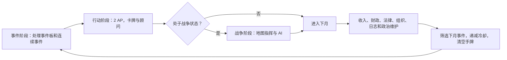
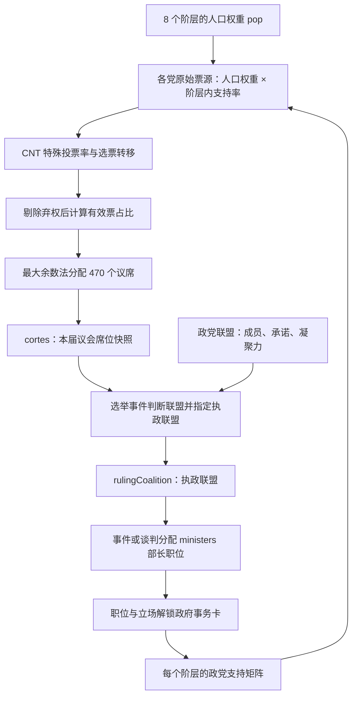

# 《自由未烬》游戏设计文档：系统机制与可玩党派扩展

>
> 读者：项目开发者、内容设计者及参与开发的 AI。当前玩家政治主体是 CNT-FAI；未来可扩展 PCE、PSOE、AP 等。
1.本文档相当于游戏设计文档，用于说明游戏各部分的机制和设计，便于开发者和AI进行阅读
2.目前玩家默认扮演CNT，未来可能拓展至PCE PSOE AP CT等党派，本文档详细解读游戏整体机制，便于后续其他可玩党派的后续制作
3.本游戏部分原型理念来自social democracy: an alternate history、Victoria 3等游戏，本文档意在叙述一种游戏架构，未来其他题材，例如民国军阀、魏玛德国、苏联末期改革、冷战美国等其他历史题材也可以基于此架构快速开发出对应游戏

## 阅读约定与目录

本文用“当前实现”说明代码实际行为，用“设计含义”解释机制的作用，用“扩展建议”表达尚未实现的方案。源代码、界面文案与旧文档不一致时，以实际条件、计算函数和状态更新为准，并记录差异。百分制中的“+5”一般指增加 5 个百分点，而非乘以 1.05。

配套文档：[游戏设计文档-数据附录](./游戏设计文档-数据附录.md)，提供法律等级与效果、卡牌条件、顾问行动、组织注册信息及事件定义索引。

| 章节 | 内容 |
| --- | --- |
| 0 | 游戏定位、资源层次、剧本与月度循环 |
| 1 | 阶层系统 |
| 2 | 政党、派系与组织系统 |
| 3 | 事件系统 |
| 4 | 卡牌系统 |
| 5 | 顾问系统 |
| 6 | 日志系统 |
| 7 | 成就系统 |
| 8 | 结局系统 |
| 9 | 政治：政府、议会与选举 |
| 10 | CNT 内部规则与专属路线 |
| 11 | 侧边栏、共和国危机与政变 |
| 12 | 工会与生产控制 |
| 13 | 法律系统 |
| 14 | 国内政治、党际关系与战时权力 |
| 15 | 经济系统 |
| 16 | 外交系统 |
| 17 | 地图与地区问题 |
| 18 | 军事与战争系统 |
| 19 | 五月事件与伊比利亚防御委员会 |
| 20 | 存档、难度、展示与开发支撑 |
| 21 | 其他可玩党派的扩展设计 |
| 22 | 已确认的实现边界与维护清单 |

## 0. 游戏定位与总循环

### 0.1 玩家在管理什么

游戏以西班牙第二共和国时期为背景，结合月度政治决策、事件叙事、组织经营和省级战争。当前版本玩家管理 CNT-FAI 运动，同时通过合作、入阁和战争介入共和国；玩家政治身份与地图上指挥的阵营并不相同。

和平时期的主要问题是：扩大社会基础、建设工会与武装、处理内部路线分歧、决定是否参与共和国制度，并应对逐步发展的军事阴谋。战争时期除前线胜负外，还要处理反法西斯联盟内部的权力分配。赢得战争与实现 CNT 的革命目标是分别判定的。

### 0.2 七组不能混用的数据

| 层次 | 主要字段 | 含义 |
| --- | --- | --- |
| 社会人口与政治认同 | `CLASS_INFO.pop`、`classes.*.support` | 各阶层权重及其内部政治倾向 |
| 组织覆盖 | `unionShare`、`organizations` | 谁组织了群众、哪些组织已经成立并仍在活动 |
| 生产关系 | `stats.workerControl`、土地改革进度 | 工人实际控制生产资料的程度 |
| 玩家行动能力 | `actionsLeft`、`resources`、`armaments` | 本月决策机会、CNT 资源及抽象地下军备 |
| 国家财政 | `budget`、税率、债务、黄金、外汇 | 国家现金流、融资与宏观经济 |
| 国家政治 | `cortes`、`activeCoalitions`、`rulingCoalition`、`ministers` | 议会授权、联盟与行政权力 |
| 战争指挥 | `mapResources`、`armies`、`entityPools` | 各阵营军需、实际部队和组织兵源 |

例如，“产业工人对 CNT 支持增加”“CNT 工会占比增加”“工人接管工厂”应分别改变政治认同、组织覆盖、生产控制。三者可以由同一次行动共同改变，但不存在自动等价换算。

### 0.3 三个剧本

| 剧本 | 开始日期 | 战争状态 | 初始执政联盟 | CNT 初始立场 |
| --- | --- | --- | --- | --- |
| 1931 | 1931 年 4 月 | 尚未内战 | 临时看守政府 | 反对 `oppose` |
| 1933 | 1933 年 11 月 | 尚未内战 | CEDA—激进党联盟 | 反对 `oppose` |
| 1936 | 1936 年 7 月 | 内战进行中，进入开战配置链 | 人民阵线 | 合作 `cooperate` |

剧本不是把日期简单后移。它分别配置阶层支持矩阵、议席、部长、组织、民兵、经济、地区自治和历史标志。1936 开局已经完成总统弹劾与总统更替，不应再次复制和平时期总统选举流程。三份剧本描述见 `src/game/scenarios/1931.ts`、`1933.ts`、`1936.ts`，开局状态由 `createScenarioState` 在剧本无关基座 `NEUTRAL_STATE` 上合并生成；`PRE_START_STATE` 只是开局前（START 界面）的状态，不是任何一个剧本的开局值。

### 0.4 月度阶段与结算顺序



月结由 `GameContext.tsx` 编排，主要计算由 `rules/monthlyPipeline.ts` 承担，实际顺序为：

1. 推进年月，将未打出的手牌并入弃牌堆。
2. 按旧状态计算 CNT 资源和军备收入，处理国际纵队增长，结算地图资源并恢复部队移动次数。
3. 激活达到时间条件的战时组织。
4. 国家经济结算：税收、支出、现金、债务、欠款、外汇、宏观指标及军费对忠诚度的影响。
5. 法律月度效果、经济困境对阶层支持的反馈、组织月度效果、工人控制度漂移。
6. 处理活跃日志的持续效果及完成／失败检查。
7. 更新 CNT 投票意愿、政党支持、联盟凝聚力、政府危机、战时联盟维护和五月事件压力。
8. 基于更新后的状态筛选事件，处理强制与优先队列；冷却减一，回到事件阶段。
9. 经统一状态整理后重新计算紧张度、处理政变里程碑、检查结局，再检查成就。

行动效果并不必然等待月末：即时资源和支持变化通常马上生效；税收、法律持续效果和日志状态检查则有月结时点。开发新系统必须明确采用哪一个时点。

**源码入口**：[状态与主循环](../src/game/GameContext.tsx)、[状态类型](../src/game/types.ts)、[月度管线](../src/game/rules/monthlyPipeline.ts)。

## 1. 阶层系统

### 1.1 八阶层及人口权重

阶级矛盾是社会的根本矛盾。游戏中有8个阶层用于模拟西班牙的阶层情况，人口权重总和为 100。

| 代码键 | 显示名称 | pop | 设计上的主要利益与冲突 |
| --- | --- | ---: | --- |
| `Obreros` | Obreros，产业工人 | 25 | 工资、工时、安全、工会、工厂管理权；社会主义与工团主义竞争的重要基础 |
| `Braceros` | Braceros，雇农 | 30 | 土地再分配、雇佣关系与农村镇压；大地产矛盾的主要承担者 |
| `Labradores` | Labradores，自耕农 | 14 | 小土地所有权、经营稳定；对强制集体化存在抵触 |
| `PequenaBurguesia` | Pequeña Burguesía，小资产阶级 | 12 | 店铺、手工业、积蓄与社会秩序；对经济危机和街头动荡敏感 |
| `Intelectuales` | Intelectuales，知识分子 | 5 | 公民自由、教育、世俗化与意识形态选择 |
| `Burguesia` | Burguesía，工业资产阶级 | 5 | 产业、利润、财产安全；与工厂占领和集体化发生冲突 |
| `Clero` | Clero，天主教会 | 8 | 宗教制度、教育和公共生活中的地位；对反教权政策敏感 |
| `Latifundistas` | Latifundistas，贵族大地主 | 1 | 大地产所有权与旧秩序；反对激进土地改革 |

这些 `pop` 是全国政治计算的固定设计权重，不是精确人口学统计。当前没有省级阶层人口、年龄、职业迁移、阶层财富账户或人口增长模拟；也没有独立的阶层满意度、激进度字段。利益冲突主要通过支持矩阵、法律效果和事件选择表达。

### 1.2 阶层支持矩阵

每个阶层拥有一个 `support` 向量，键为 `CNT_FAI` 与除 `PRRevS` 外的各个 `Party`。一个阶层的各政治力量支持份额应合计 100。`PRRevS` 是 CNT 的选举出口，没有第二套独立群众支持池。

`adjustClassSupport(classes, classId, force, delta)` 调用零和份额算法：提高目标份额时由其他份额按比例承担，降低时由其他份额吸收；处理边界与舍入，返回更新后的对象。不能只对一个键加数而让总和膨胀。

全国某力量支持度的读取公式为：

```text
全国支持(p) = Σc [pop(c) / 100 × support(c,p) / Σq support(c,q) × 100]
```

在每行已归一化时，等价于 `Σ(pop × 阶层内支持 / 100)`。例如，产业工人占 25，工人中的 CNT 支持增加 4 点，将为全国 CNT 支持贡献约 1 点；其他力量在同一阶层中的支持相应下降。

注意：全国支持读取会按每行总和归一化，但原始选票计算直接使用 `support / 100`。破坏矩阵不变量可能造成“面板支持”与“选票计算”不一致，不能把读取端的容错当作允许任意写入的理由。

### 1.3 支持如何变化

主要写入来源包括事件立场、行动卡、顾问、法律月度效果、税制政治反应和经济困境。示例：

- 工会扩张的城市选项：产业工人对 CNT +3，同时 CNT 工会占比 +2、工团派影响力 +5；三项各自结算。
- 无法承受的会费会损失产业工人和雇农支持。
- 失业率高于 15 时，小资产阶级向 AP 倾斜；工人和雇农同时有向 CNT 与已成立 FE 倾斜的效果。
- 普选、教育、混合陪审团等法律持续改变具体阶层对具体政党的支持。

“阶级矛盾是根本矛盾”在当前玩法中体现为：同一政策对不同阶层产生不同政治后果，而非一个可以统一增加的全国好感值。未来新可玩党派应复用同一矩阵，并设计自身动员和联盟方式。

**源码入口**：[阶层定义](../src/game/constants.ts)、[支持与剧本矩阵](../src/game/parties.ts)、[支持变更](../src/game/utils/classSupport.ts)、[零和算法](../src/game/utils/zeroSumShare.ts)。

## 2. 政党、派系与组织系统

### 2.1 政党是全国政治表达层

`Party` 当前包含 16 个键：`POUM`、`PCE`、`PSOE`、`PS`、`ERC`、`IR`、`UR`、`PNV`、`PRR`、`DLR`、`AP`、`RE`、`CT`、`FE`、`Other`、`PRRevS`。

| 类别 | 身份与作用 |
| --- | --- |
| 工人左翼 | PCE、PSOE、POUM，以及工团主义党 PS |
| 共和派与地方主义 | ERC、IR、UR、PNV、PRR、DLR |
| 保守与反共和国力量 | AP、RE、CT、FE |
| 汇总桶 | Other，其他党派与独立人士，没有统一法律纲领 |
| CNT 选举身份 | PRRevS，以 CNT 群众支持及投票意愿生成选票 |

开发时使用稳定键，面向玩家使用阶段名称：

| 稳定键 | 当前名称映射及阶段 |
| --- | --- |
| `PCE` | 西班牙共产党 |
| `PSOE` | 西班牙工人社会党 |
| `POUM` | 马克思主义统一工人党 |
| `PS` | 工团主义党 |
| `ERC` | 加泰罗尼亚共和左翼 |
| `PNV` | 巴斯克民族主义党 |
| `IR` | 共和行动 AR → 共和左翼 IR |
| `UR` | 激进社会共和党 PRRS → 共和联盟 UR |
| `PRR` | 共和激进党 |
| `DLR` | 自由共和右翼 |
| `AP` | 人民行动党 AP → 西班牙自治右翼联盟 CEDA |
| `RE` | 西班牙革新党 |
| `CT` | 传统主义者合一会 |
| `FE` | 西班牙长枪党 → FE de las JONS |
| `Other` | 其他党派与独立人士 |
| `PRRevS` | 革命共和工团党 |

`CNT_FAI` 本身不在 `Party` 联合类型中，但作为 `PoliticalActor`、联盟成员和阶层支持键独立存在。部长归属使用 `CNT`，党派关系使用 `partyRelations`，战争阵营使用 `MapFaction`。这些是不同命名空间，开发时必须做显式映射。

`partySupport` 是从阶层计算出的缓存；`cortes` 是某次选举留下的议席快照。社会支持改变不会自动每月改写在任议会。

### 2.2 名称阶段与成立状态

`getPartyName` 根据状态显示历史阶段，但保留底层键：

- `IR` 在合并前显示 AR，共和行动；成立后显示共和左翼。
- `UR` 在合并前显示 PRRS；成立后显示共和联盟。
- `AP` 根据 `ceda_formed` 显示 AP 或 CEDA。
- `FE` 根据 `falange_jons` 显示 FE 或 FE de las JONS。
- CNT 的展示可在 PRRevS 成立后切换为该选举身份。

成立、名称、是否可进入共和国政治、是否有议席，不是同一件事。当前不同子系统对“存在”的判定仍有差异：法律界面部分读取成立标志，战时政治优先读取组织状态，而原始选票函数并未统一过滤未成立党派。扩展时需要统一资格层，不能仅隐藏 UI。

### 2.3 CNT 内部派系

| 键 | 名称 | 玩法定位 | 默认模板：影响力／异议度 |
| --- | --- | --- | --- |
| `Treintistas` | 三十人集团 | 温和工团、制度合作、建党与选举路线 | 10／30 |
| `Cenetistas` | 工团派 | 工会组织、团结与务实协调 | 35／10 |
| `Faistas` | 无政府主义者 | 直接行动、武装与革命推进 | 45／15 |
| `Puristas` | 纯粹派 | 反参政、反官僚化及原则维护 | 10／20 |
| `Jabalistas` | 野猪议员 | 事件解锁的激进联邦主义与拉蒙路线 | 0／0 |

影响力是内部路线的相对权重，合计 100；异议度是每派独立的 0—100 数值，不要求总和为 100。`adjustFactionInfluence` 零和重分配影响力，异议度使用单派、多派或全部活跃派系的专用 helper。

```text
整体异议 D = Σ(活跃派系影响力 × 异议度) / Σ活跃派系影响力
统一行动效率 M = 1 - D / 100
```

野猪派只有影响力大于 0 才计入活跃派系的异议处理。影响力与异议相乘意味着：安抚一个有实权的大派通常比安抚边缘派更能提升整体效率。部分行动使用 `M`，部分顾问只使用所属派系的 `1 - dissent/100`；不是所有收益都统一乘效率。

其他党派尚无通用内部派系数据结构。不能把上述五派直接解释为全国政治阵营；未来应建立按党派归属的派系注册表。

### 2.4 组织是实际行动载体

组织注册表记录 `id`、类型、所属政治力量、剧本默认成立状态、成立日期、显示可见性、武装实体链接与可选月度效果。实例状态包含 `established`、`status`、`establishedAt`，民兵组织另有 `militiaManpower`。

生命周期为 `unformed → active → integrated / dissolved`。`isOrganizationEstablished` 与 `isOrganizationActive` 含义不同；整编后的组织不应继续使用只属于活跃组织的募兵入口。

| 所属力量 | 代表组织 |
| --- | --- |
| CNT-FAI | CNT、FAI、FIJL、自由女性 ML、全国农民联合会 FNA、防御委员会 DC、PRRevS |
| PSOE | UGT、社会主义民兵、JJSS、FNTT、JSU |
| PCE | MAOC、第五团、UJCE、反法西斯妇女、国际纵队的注册归属 |
| POUM | POUM 民兵、JCI |
| FE | JONS、SEU、妇女部、长枪党民兵、CONS |
| 地区与保守力量 | ERC 的拉巴塞尔联盟、PNV 的 ELA／EGI／巴斯克民族军、AP 的 CNCA、传统主义相关组织 |

大部分组织目前承担成立门槛、叙事身份或兵源归属功能，以及部分组织会有月度效果、启用卡牌等功能

`uiVisibility: internal` 只表示不在某些组织列表展示，不表示不存在。FNA 等已有注册入口，也不能据此断言其完整专属内容已经完成。完整组织清单见数据附录。

**源码入口**：[党派身份](../src/game/parties.ts)、[党派名称](../src/game/partyNames.ts)、[派系 helper](../src/game/utils/factionEffects.ts)、[组织注册与生命周期](../src/game/organizations.ts)。

## 3. 事件系统
事件是整个游戏中的核心系统之一，承担叙事、进程推进、启用日志等重要任务

### 3.1 事件是状态转换

`GameEvent` 由稳定 ID、可选日期和条件、双语标题与叙述、选项以及可选自定义 UI 组成。选项 `effect(state)` 返回 `Partial<GameState>`。效果可以改变数值、设置旗标、建立组织、打开后续事件或将事件排入队列。

事件选项没有统一 AP 费用；费用必须来自调用者或该选项效果。卡牌打开的事件通常已在打牌时支付 AP，继续点击内部菜单不是再次打牌。

### 3.2 普通触发规则

| 模式 | 有日期事件 | 无日期事件 |
| --- | --- | --- |
| 历史难度 | 必须匹配准确年月；有条件还要满足条件 | 依赖条件 |
| 简单／普通／困难／沙盒 | 日期本身不触发；只依赖条件 | 依赖条件 |

开局和月结扫描 `INITIAL_EVENTS`。开局扫描忽略既有历史；后续扫描默认排除已经触发或解决的非重复事件，同时避免与当前事件和队列重复。

当前重复事件由顶层 `repeatable: true` 控制；`meta.tags` 中的 `repeatable` 不参与运行时判断。PRRevS 延期建党事件同时依靠显式重复标记、三个月间隔和永久放弃旗标。

历史模式并不意味着全部事件都有固定日期。例如阿斯图里亚斯革命没有 `date`，在历史难度下仍由“1934 年 10 月或以后”等条件控制。直接指定后续事件也不会重新经过普通日期筛选。

### 3.3 队列、连续链与优先级

- `pendingEvents`：已进入事件板、尚未选择的事件。
- `currentEvent`：正在处理的事件或连续链节点。
- `eventHistory.triggered / resolved`：两个独立集合，用于防重复和成就／剧情检查。
- `superEvent`：战争开始等重要转场；关闭内战超级事件会进入开战配置。

选项返回后续 `currentEvent` 就继续当前链；不返回后续时当前事件关闭。队列和当前事件都清空后，事件阶段转为行动阶段并给予 2 AP。普通事件可以从事件板选择；战时权力安排和五月事件存在强制优先处理规则。

月度队列还负责：强制下月阿斯图里亚斯旗标、政府危机导致的总统解散事件、战时过滤和平选举链、三方战争过滤旧的双边投降事件。

### 3.4 编辑器与运行时边界

`meta.category` 为 `news / cnt / politics / war / other`；`flow` 为 `solo / inline.root / inline.node / inline.leaf`；`series` 与 `tags` 用于内容归类与编辑器。它们不决定事件是否触发或链如何跳转。

`INITIAL_EVENTS` 是调度候选表；`RESTORABLE_EVENTS` 是加载存档时恢复事件函数的注册表。只为恢复存档加入的链中间节点不应随意加入自动调度表。

### 3.5 内容制作规则

先写前置条件、即时效果、后续节点与持久标志，再编写叙述。重要约束包括：ID 稳定；中英文机械含义一致；选项禁用原因准确；支持／派系变更通过 helper；纯导航不重复扣费；结果确认可以无数值变化，但不能用空效果掩盖未完成的选择。

扩展党派时应让事件区分“世界已经发生什么”与“当前玩家能做什么”。目前大量事件直接面向 CNT 发问，尚不存在统一的 `playerParty` 过滤。

**源码入口**：[触发规则](../src/game/utils/eventTrigger.ts)、[事件注册](../src/game/events/index.ts)、[事件 reducer](../src/game/reducers/eventReducer.ts)、[事件板](../src/components/EventBoard.tsx)。

## 4. 卡牌系统

### 4.1 卡牌与事件的分工

卡牌系统是游戏的核心玩法，卡牌决定某项主动事务何时进入玩家选择范围，并收取 AP；事件承载事务的具体方案。当前共有 **26 张注册卡牌：15 行动、8 政府、3 武装**，`Card.type` 实际值为 `Action / Government / Military`，全部注册卡的基础费用为 1 AP。

### 4.2 抽取、支付与循环

1. 从所选类别牌库筛选满足顶层 `condition` 的牌，等概率抽取。
2. 手牌上限通常为 4，困难为 3。抽牌本身不减少 AP。
3. 若没有可抽牌，尝试把该类弃牌回收再筛选，而不是无条件补满整副牌。
4. 打牌检查行动点、顶层资源费、军备费与条件；执行效果后扣基础 AP 和顶层费用，将牌移入弃牌堆。
5. 选项中的追加费用由选项条件和效果承担。
6. 月末剩余手牌全部弃置；冷却按月递减。牌在手中不意味着能无视最新条件打出。

当前 `PLAY_CARD` 只要求 `actionsLeft > 0`，没有通用校验 `actionsLeft >= card.cost`。由于现有牌均为 1 AP，现状可工作；未来加入多 AP 卡时必须修正这一前提。顶层 `effect` 对资源／军备的修改还可能被随后按原状态扣费用的写入覆盖，资源收益应在具体选项中结算或由支付层统一合并。

### 4.3 行动事务

| 卡牌 | 主要决策领域 | 当前冷却与门槛 |
| --- | --- | --- |
| 罢工 | 有限示威、总罢工、声援被捕者、经济诉求 | 顶层消耗 1 资源，无独立计时器 |
| 工会扩张 | 城市工厂、农村组织、暂停扩张 | 无独立计时器 |
| 筹款 | 调整会费，资金与支持／团结取舍 | 6 月 |
| 群众集会 | 宣传路线、街头动员、镇压和冲突分支 | 6 月，可衔接罢工／竞选 |
| PRRevS 竞选宣传 | 争取不同阶层、提高投票意愿 | 3 月；PRRevS 成立、三十人集团仍活跃 |
| 媒体 | 报刊、广播、影院、宣传经营 | 6 月 |
| 组织 | 互助、文化教育、防御准备、建立青年／妇女组织 | 6 月 |
| FIJL | 青年动员和组织事务 | 6 月，FIJL 已成立 |
| 自由女性 | 妇女组织、教育和社会动员 | 6 月，ML 已成立 |
| 国际联系 | 运动层面的跨国关系 | 9 月，与国家外交共用国际关系计时器 |
| 同志间的分歧 | 调解或压制内部路线冲突 | 顶层按派系异议阈值开放，无专属冷却 |
| 选择我们的敌人 | 确定宣传和斗争重点 | 18 月 |
| 与政党之间的关系 | 改善／恶化具体党际关系 | 6 月 |
| 土地与自由 | 自愿合作社、农村集体化、武装没收 | 无独立计时器；武装选项要求军备 |
| 以行动宣传 | 暗杀、训练、转向媒体或罢工 | 8 月，内战尚未开始 |

卡牌标题不等于其全部效果。例如罢工和工会扩张仍有“提高工人控制度”的旧描述，但当前组织扩张选项实际主要改变 `unionShare`。应以效果代码与效果预览为准。

### 4.4 政府事务

| 卡牌 | 权力门槛 | 主要机制 |
| --- | --- | --- |
| 军事政策 | CNT 参政且掌战争部 | 军费、军官部署、政变进度；6 月冷却 |
| 警察事务 | CNT 参政且掌内政部 | 提升警察忠诚、推进治安机关改革；6 月 |
| 农业政策 | CNT 参政且掌农业部 | 土地法律、农村政策与阶层反应；冷却见具体选项 |
| 劳工权利 | CNT 参政且掌劳工部 | 工时、工资、安全制度 |
| 劳工事务 | CNT 参政且掌劳工部 | 劳资冲突中支持工人、资方或调解；10 月 |
| 财政政策 | CNT 参政且掌财政部 | 所得税／间接税草案、政治反应、统一生效；6 月 |
| 外交政策 | CNT 参政且掌国务部 `estado` | 各国谈判及外援；实质决定后 2 月 |
| 弹劾总统 | 弹劾已解锁、未完成、尚未内战 | 进入总统去留与后续选举流程，不采用普通部委条件 |

拥有议席、支持政府、进入内阁、掌握特定部委是四种不同权力。大多数政府牌需要最后一层。

财政卡是一个付费审查窗口：可以分别处理所得税组与贸易／消费税组；同组只提交一次政治反应，税率草案与现行税制分离，结束审查时统一写入。菜单导航本身不结束审查。外交卡则在选定实质外交行动后结束，返回上层菜单不收取额外 AP。

### 4.5 武装事务

| 卡牌 | 主要输入与效果 | 冷却 |
| --- | --- | ---: |
| 阿拉贡前线 | 阿拉贡委员会存在、DC 活跃；招募、纪律、与乡村教会协商 | 3 月 |
| 民兵整编 | 已发生内战、DC 活跃；军备用于训练、扩军或精锐建设 | 1 月 |
| 无政府？坦克？！ | 已发生内战、DC 活跃、项目未完成；研究、加速、测试 | 6 月 |

这些牌管理政治运动的武装建设和项目，不代替地图上的移动、补员与战斗。部分军备效果要通过开战动员或具体桥接逻辑才能转成地图军力。

**源码入口**：[总卡表](../src/game/data.ts)、[行动卡表](../src/game/action_affairs/index.ts)、[政府卡表](../src/game/government_affairs/index.ts)、[武装卡表](../src/game/military_affairs/index.ts)、[打牌和抽牌](../src/game/reducers/eventReducer.ts)。

## 5. 顾问系统

顾问提供不依赖随机抽牌的主动行动。当前注册 **19 位顾问**，场上最多 3 位；任免在顾问池和活跃槽位之间转移，当前不消耗 AP。顾问行动由 UI 支付 1 AP，并检查其自身条件。

所有顾问共用 `advisorActionTimer`，现有行动通常设为 6 个月。这意味着任命三位顾问扩大的是可选方案，而不是每人拥有独立的六个月行动额度。换人不会重置全局冷却。

| 路线 | 代表顾问与用途 |
| --- | --- |
| 温和与建党 | 佩斯塔尼亚：共和派关系、三十人集团、PRRevS 筹备；佩罗与洛佩斯：合作社、工业与工团教育 |
| 武装与革命 | 杜鲁蒂、阿斯卡索、加西亚·奥利弗：民兵、纪律、武装与防卫；桑蒂利安：经济规划和军需 |
| 社会改革 | 蒙特塞尼：卫生、妇女与合作；布兰科：教育、卫生和工人联合 |
| 内部协调 | 普列托、马里亚诺：团结、妥协和组织指挥 |
| 原则维护 | 巴利乌斯、佩拉茨：反官僚化、反部长路线与革命主张 |
| 工人联盟 | 奥罗本：与 UGT 的关系、推动工人联盟进度 |
| 野猪路线 | 拉蒙·佛朗哥、瓦利纳、巴里奥贝罗：联邦主义、总统竞选、南方农运与司法 |
| 治安与人道 | 奥雷利奥、梅尔乔：侦察、巡逻、秩序和人道救援 |

初始顾问池排除拉蒙、瓦利纳、巴里奥贝罗，须经剧情解锁。角色生死、退出运动和事件选择也可能影响可用性，不能只把顾问视为永久装备。

部分顾问收益按自身派系异议衰减，另一些是固定效果。人物叙述不等于时期门槛：部分描述为战时工作的行动，代码条件只有共享冷却。新增党派顾问时应显式定义归属、时期、岗位和组织前提。

**源码入口**：[顾问注册](../src/game/advisors/index.ts)、[顾问界面与 AP 支付](../src/components/AdvisorPanel.tsx)。完整 19 人行动表见附录。

## 6. 日志系统

### 6.1 日志的职责

日志是跨多个月的战略目标，对玩家而言是完成有奖励，失败有惩罚，并且日志本身可能带有月度效果。本质来讲是一种有反馈的任务系统，词义上需要与普通消息历史作区分。
`JournalState` 记录 `inactive / active / completed / failed`、进度与可选失败进度；`JournalEntryDef` 定义显示进度、状态检查、月度效果、终局回调，以及三个事件槽位 `activationEventId` / `completionEventId` / `failureEventId`。

**统一契约**（实现见 `src/game/rules/journalEvents.ts`）：

> **触发事件（条件满足即排队）→ 事件选项调用 `activateJournal()` 激活日志 → 日志按月运行 `activeEffect` → 完成/失败条件满足 → 日志自己结算 `onComplete` / `onFail` → 管线推入结果事件（同一回合的事件阶段即可读到）**

三条边界：

1. **激活只属于开始事件。** 声明了 `activationEventId` 的日志不再自行激活，`checkStatus` 不得返回 `active`（月结管线用 `isEventMediatedJournal()` 忽略这类返回值）；换言之**日志本身不持有触发条件**，触发条件写在开始事件的 `condition` 里。
2. **数值效果只属于日志。** 结果事件只负责叙事；不要在事件选项里重复发奖，也不要手动改 `pendingEvents`——结果事件由 `completionEventId` / `failureEventId` 自动入队，同 id 已排队、正在展示或已处理过时不会重复推入。
3. **月度效果不变。** `activeEffect.apply` 仍在每月结算的最前面执行，且只在日志处于 `active` 时运行；完成或失败后的日志不会重新激活。

时点：`checkStatus` 的唯一调用点仍是月结管线（`GameContext.tsx` 月度分支），所以完成/失败永远发生在月份推进的那一刻；`onComplete` / `onFail` 的数值在同一次结算内立即合并，结果事件随新月份的事件阶段一起出现。

### 6.2 六条现有日志

| 日志 | 开始事件 | 完成条件 | 失败／持续效果 | 完成结果 | 结果事件 | 备注 |
| --- | --- | --- | --- | --- | --- | --- |
| 土地改革问题 | ⚠️ 无（`checkStatus` 自动激活，待迁移） | 土改进度 100 | 活跃时热情 +1/月；原本活跃且本月进度未增加时失败进度 +1，至 100 失败 | 工人控制 +10、热情 -10；失败则工人控制 -10 | 无 | 可能会重置为两个日志一个是土地改革，一个是土地集体化 |
| 地区问题 | ⚠️ 无（同上） | 地区自治进度 100 | 紧张度达到 90 失败；活跃时共和国权威 -1/月 | 当前没有额外数值奖励 | 无 | 可能会移除，因为地区问题与CNT和目前游戏机制关系不显著，也可能重制 |
| 伊比利亚之梦 | ⚠️ 无（同上） | 葡萄牙隐蔽行动进度 100 | 内战进行中则失败；成功检查在失败检查之前 | 共和国权威 +15 | 无 | 此日志正在修改中，本质上来讲是奖励吞并葡萄牙的玩家 需要重置 |
| UHP | ✅ `workers_alliance_attempt`（选项效果调用 `activateJournal`） | PSOE 关系达到 70 | PSOE 位于共和—社会党联盟或人民阵线时失败 | 设置工人联盟日志激活状态 | 无 | 已迁移为契约的参考实现；UHP 与工人联盟本质是两阶段，未来可能重置为一个统一的日志 |
| 工人联盟 | ⚠️ 无（由 UHP 的 `onComplete` 写 `alliance_obrera_activated`，待迁移） | PSOE 关系 ≥80、联盟推动次数 ≥3、CNT 占比 ≥18、CNT+UGT ≥35、右翼工会 ≤12 | PSOE 进入上述两种政治联盟时失败 | 建立非执政工人联盟；结果事件由管线自动入队 | ✅ `workers_alliance_formation` | 同上 |
| 伊比利亚之鹰 | ⚠️ 无（同上） | ERC 关系 ≥80，拉蒙竞选 ≥3 次 | 当前没有完整失败条件 | 野猪影响 +10、ERC 关系 +15、FAI／纯粹派异议各 +12、热情 +5、权威 -5 | 无 | 此日志还在检测中 可能会修改或者重置 |

工人联盟“推动次数”的实际进度来自行动写入，应看 `workersAllianceProgress`：它只由十字路口选项 A（+2）与奥罗本／布兰科的「推动工人联盟」顾问行动（各 +1，且必须在 UHP 完成后才可选）提供，因此进度是确定的整数，不存在按异议效率缩放。伊比利亚之鹰完成不直接任命总统；总统职位仍由总统选举链决定。

### 6.3 迁移状态与待办

**机制已经落地**：`JournalEntryDef` 持有 `activationEventId` / `completionEventId` / `failureEventId`，共享实现位于 `src/game/rules/journalEvents.ts`（`isEventMediatedJournal` / `activateJournal` / `getJournalOutcomeEventId` / `queueJournalOutcomeEvent`），月结管线按契约执行。已迁移两条：

- **UHP**：开始事件 `workers_alliance_attempt`，其选项效果调用 `activateJournal(state, 'journal_uhp')`。日志因此**在事件解析的那一刻**变为 `active`，不再等月结；旧的 `uhp_journal_activated` 标志已删除（旧档由 `deserializeGameState` 中的迁移补齐）。
- **工人联盟**：结果事件 `workers_alliance_formation`。`onComplete` 只负责成立联盟，事件由管线在同一次结算里自动入队，不再手写 `pendingEvents`。

**待迁移（本轮按“只做机制、不写事件”的约定只登记，不落笔）**：

| 待办 | 具体日志 | 迁移做法 |
| --- | --- | --- |
| 开始事件缺失（日志仍自带触发条件） | 土地改革、地区问题、伊比利亚之梦、伊比利亚之鹰 | 把 `checkStatus` 里的激活分支搬进开始事件的 `condition`，选项效果调用 `activateJournal(state, '<journalId>')`，声明 `activationEventId`，然后删掉 `checkStatus` 里的激活分支 |
| 开始事件缺失（激活靠标志位） | 工人联盟（由 UHP 的 `onComplete` 写 `alliance_obrera_activated`） | 补一个开始事件，或并入 UHP 的统一日志（该日志本身也在重制清单里） |
| 结果事件缺失 | 全部 6 本日志的**失败**侧；土地改革／地区问题／伊比利亚之梦／伊比利亚之鹰的**完成**侧 | 逐条写叙事事件并登记 `completionEventId` / `failureEventId`；数值仍留在日志，事件里不要重复发奖 |

**写新日志时的检查清单**：① 触发条件写在开始事件的 `condition`，不要写回 `checkStatus`；② 奖励/惩罚只写 `onComplete` / `onFail`；③ 结果事件只叙事，且必须注册进 `RESTORABLE_EVENTS`（否则存档无法还原该事件）；④ 月度效果写在 `activeEffect`，只在 `active` 时生效。

还需区分三种“日志”：任务日志 `journal`、事件历史 `eventHistory`、战争消息 `mapHistory`。它们的用途和存档结构不同。

### 6.4 两处已知实现问题

**① `JournalState.progress` 是死字段。** 它在 `scenarios/base.ts` 里被初始化为 `0`，此后**全项目没有任何一处写入它**：月结管线只写 `status` 与 `failureProgress`，进度显示全部走 `getProgress(state, entryState)`（6 本日志都实现了它），`JournalPanel` 里 `entryState.progress` 只是永不生效的兜底分支。唯一读取它的是 `land_reform.checkStatus` 的 `entryState.progress >= 100`——因为永远为 0，这个判断永远不成立，真正的判定靠 `state.domesticPolicy.land_reform_progress`。成因是设计演进：早期进度存在日志条目里，后来改成「进度属于真实游戏状态、由 `getProgress` 读出」，字段却留在了类型里。处理方向：删除该字段，或把它明确降级为「仅存档展示用的缓存」并在写入侧补齐。

**② `checkStatus` 带副作用。** `ramon_franco_presidency.checkStatus` 在 `inactive` 分支里直接写 `state.journal_ramon_franco_presidency_seen = true`。它能生效，是因为月结管线把**活的 `tempState` 对象**传了进来，而这个对象随后会被展开进新状态——也就是说，它依赖一个类型签名（`(state, entryState) => JournalStatus | null`）完全没有承诺的实现细节。风险：判定函数一旦被预览、测试或别的调用方用克隆状态调用，这个写入就会落在克隆体上而静默丢失；同时它让「本日志是否已经开启过」的事实分裂成两个来源（状态里的 `seen` 标志 + 日志自身的 `status`）。成因是契约缺口：`checkStatus` 只能返回一个状态字符串，无法返回补丁，而作者又需要在激活的同一时刻落一个标志位。处理方向：把这类写入搬进开始事件的选项效果（`activateJournal` 同处），让 `checkStatus` 恢复为纯判定。

**源码入口**：[日志注册](../src/game/journal/index.ts)、[日志界面](../src/components/JournalPanel.tsx)、[月结处理](../src/game/GameContext.tsx)、[事件契约](../src/game/rules/journalEvents.ts)。

## 7. 成就系统

当前注册 20 项成就。每次 reducer 处理后的结局检查之后，再运行 `checkAchievements`。本局记录在 `unlockedAchievementsThisRun`；全局解锁保存在浏览器 `cnt_fai_achievements`，历史难度另写 `cnt_fai_achievements_historical`。沙盒不授予成就。

| 成就 | 实际关键条件 |
| --- | --- |
| 人民之子／他们已通过／人民阵线 | 分别命中对应结局 |
| 革命兵工厂 | 抽象军备 ≥50 |
| 牢不可破的联盟 | 加权整体异议恰为 0 |
| 到街垒去 | 兼容民兵字段 `cntFai` **大于** 100000，不是 ≥ |
| 杜鲁蒂之梦 | 内战胜利、杜鲁蒂存活、Faistas 影响力严格高于三十人／工团／纯粹三派 |
| 向加泰罗尼亚致敬 | 地区独立且控制为 CNT 或委员会 |
| 解放神学 | 教会阶层对 CNT 支持 ≥40 |
| 黑漆战车 | `hasArmoredCars` 为真 |
| 自由妇女 | ML 成立，女性权利达到最高等级 |
| 当世界正年轻 | `internationalBrigadesFormed` 为真；目前未检查真实抵达马德里的地图位置 |
| 雅典娜热 | 女性权利和教育最高级、学苑 ≥5 |
| 另一个佛朗哥 | 总统名称为 `Ramón Franco` |
| 无人生还 | 指定八名政治／军事人物全部死亡 |
| 不要投票！ | 已到结局，且 CNT 从未离开反对立场 |
| 无党之党 | PRRevS 已成立 |
| 三个火枪手 | 阿斯卡索、杜鲁蒂、加西亚·奥利弗同时任顾问 |
| 世界语 | 语言法达到最高等级 |
| 人民奥林匹克 | 已解决 `olimpiada_popular` 事件 |

“不要投票”使用单向历史标志 `cntStanceAlwaysOpposed`。一度合作或参政后再恢复反对，不能恢复资格。新党派成就应判断玩家身份，避免把敌对党派的叙事胜利当作玩家失败或成就。

**源码入口**：[成就条件与全局记录](../src/game/achievements.tsx)、[成就展示](../src/components/AchievementsModal.tsx)。

## 8. 结局系统

结局不是只看最后战争输赢，而是一个有优先级的条件链。若 `isGameOver` 已经为真，则不重新选择结局。

### 8.1 普通路线：按以下顺序命中即停止

| 优先级 | 结局 | 当前判定 |
| ---: | --- | --- |
| 1 | 大清洗 | 全国 PCE 支持 >80，且 CNT 参政 |
| 2 | 阿斯图里亚斯工人的挽歌 | 阿斯图里亚斯战争为 `lost` |
| 3 | 我们已经通过 | 西班牙内战为 `lost` |
| 4 | 俄属西班牙 | 内战胜利、莫斯科黄金已转移、PCE 支持 >80、PCE 掌权且接受共产国际 |
| 5 | 人民之子 | 内战胜利、革命热情 >80、整体异议 <30 |
| 6 | 人民阵线 | 内战胜利、革命热情 <40、CNT 参政 |
| 7 | 脆弱的和平 | 内战胜利但未满足上面特定条件 |
| 8 | 寂静的共和 | 年份 ≥1939，内战从未开始 |
| 9 | 丧钟为谁而鸣 | 年份 ≥1939，内战仍在进行 |

因此相同战争胜利可以进入不同政治结局。“大清洗”检查在“俄属西班牙”之前，如果同时满足，前者覆盖后者。PCE 相关掌权旗标的可达性还要检查内容写入端，不能仅因存在结局就假定普通流程一定能达成。

### 8.2 三方路线

存在 `iberianDefense` 时，普通政治结局和 1939 年截止被绕开，直到三方战争只剩一个阵营：委员会获胜进入“防御委员会的胜利”；共和国获胜进入“马德里政府获胜”；国民军获胜进入“我们已经通过”。委员会先被消灭时可以已经失去玩家操作权，但仍等待剩余阵营决出最终赢家。

扩展其他党派时，需要把“世界结果”和“玩家评价”拆开。例如 PCE 的胜利不能继续无条件使用 CNT 视角的失败评价。

**源码入口**：[结局优先级](../src/game/endings.ts)、[结局画面](../src/components/EndingScreen.tsx)。

## 9. 政治：政府、议会与选举

### 9.1 从阶层人口到内阁的完整关系



阶层是票源，政党是选票与议席的归属主体，政党联盟是合作协议，执政联盟是当前组织政府的联盟，内阁则是具体行政职位的分配结果。五者分别保存，不应合并为一个“执政党”字段。

`partySupport` 会随着社会支持变化而更新；`cortes` 在选举时生成，此后不会因为一次宣传或罢工直接重分席位。组建一个新联盟也不会自动推翻现任政府。部长所属党派、CNT 参政立场和执政联盟成员应共同解释，不能由其中任意一个字段推导其他字段。

### 9.2 选票计算与 CNT 弃权问题

对普通党派，原始票源为：

```text
V(p) = Σc [pop(c) × support(c,p) / 100]
```

CNT 的社会支持先乘 `cntVotingRate / 100`，剩余部分视为不投票。对于投票部分：

1. PRRevS 已成立：全部归入 `PRRevS` 选票。
2. PRRevS 未成立：只向与 CNT 关系严格大于 60 的合格党派转移，排除 `Other` 和 `PRRevS`；按这些党派的关系值本身比例分配。
3. 没有合格接收党：CNT 的这部分票源也不会进入有效票总额。

例如 CNT 原始票源占总人口 20%，投票率为 50%，则最多贡献 10 个票源单位；如果两个合格盟友的关系分别为 80、70，就按 80∶70 分配，而不是按它们超过 60 的幅度分配。所有党派最后按有效票总额重新归一化，弃权因此会提高其他党派的有效票占比。

当前没有按省份分配议席，也没有单独模拟各阶层投票率、年龄与性别选民人口。妇女权利等法律不会自动改变 `pop` 或选举分母。联盟名称和竞选叙事也不额外提供席位奖励。

### 9.3 470 席的分配

先计算每党的理论席位 `470 × 有效票占比`，取整数部分，再把剩余席位依小数余数从大到小补齐。正常存在有效票时，总席位为 470。严格多数门槛为 236 席。

`getEffectiveCortes` 是政治资格过滤后的席位视图。战时被排除或退出的党派失去有效政治席位，但原始选举记录仍保留；这些席位形成空缺，不自动转给执政党。它与重新举行一次选举不同。

### 9.4 历史选举与提前选举的实际差异

| 入口 | 当前决定政府的方法 | 设计边界 |
| --- | --- | --- |
| 1931 制宪选举 | 计算席位后，事件提供共和—社会主义路线；共和派联合路线要求其指定成员总席位 >235 | 第一条路线没有同样的多数条件；界面展示的联合成员与联盟定义存在差异 |
| 1933 大选 | 计算席位，但结果事件直接成立 CEDA—激进党政府 | 不是所有票型都可产生不同政府；同时回退土改、劳工法及 CNT 工会份额 |
| 1936 大选 | 比较指定左翼七党与右翼四党总席位；左翼不低于右翼即人民阵线，否则国民阵线 | 没有普遍要求 236 席；中间派、PRRevS 不参加这次左右比较 |
| 提前选举 | 比较左翼、PRR／DLR／AP 中右组合、FE／CT／RE／AP 国民组合，选最大者 | AP 出现在两个比较组合；同票优先左翼，再中右，并非互斥选举联盟算法 |

提前选举中左翼获胜后，1935 年起或既有路线旗标满足时采用人民阵线，否则采用共和—社会主义联盟；部长分配较为概括。以上是当前脚本规则，不应被误写成一套已经完整实现的通用议会民主模型。

### 9.5 联盟定义与维护
这一部分可能需要修改，思路为：大选前通过事件成立政党联盟（成立事件不同选项可能会导致同名政党联盟成员不同），成立的政党联盟作为大选结果的可选选项

| 联盟 ID | 默认成员 | 解体阈值／特殊处理 |
| --- | --- | --- |
| `provisional_government` | PSOE、IR、UR、DLR、PRR、ERC | 凝聚力 <10 |
| `republican_socialist` | PSOE、IR、UR、DLR | <20 |
| `republican_coalition` | ERC、IR、UR、PRR、DLR | <20 |
| `popular_front` | PSOE、PCE、IR、UR、POUM、PS、ERC | <15 |
| `ceda_radical` | AP、DLR、PRR | <20 |
| `workers_alliance` | PSOE、CNT-FAI、PCE、POUM | <10 |
| `national_front` | FE、CT、RE、AP | <25 |
| `popular_front_wartime` | CNT、PSOE、PCE、IR、UR、ERC、PNV、POUM、PS | 战时单独处理，不直接照搬和平解体 |

普通联盟凝聚力按成员全国支持权重加权其承诺度；没有另行设置时，承诺度使用默认值。对 CNT 的联盟态度按成员社会权重和党际关系汇总。组建与执政是不同操作：普通 `formCoalition` 维护合作关系，选举专用入口才安装选出的执政联盟。

普通执政联盟凝聚力跌破阈值后，会留下解体历史、清空执政联盟，并进入政府危机及后续选举事件，而非立即让支持率最高的党接管。战时政府使用第 14、19 章的承诺、军事力量和危机规则。

### 9.6 总统与内阁并非同一职位

总统选举使用两部分政治权重：本届议会 470 席，以及依据当前社会支持重新计算的 470 名选举人。候选路线包括左翼候选人、马丁内斯·巴里奥、希尔·罗夫莱斯等。第一轮门槛为 `ceil(940 × 2/3)=627`，第二轮取最高票者。

这是一套事件化的间接选举：党派票权按候选倾向分配，游说和 CNT 纪律还会增加票数，因此最终候选票数不保证严格守恒为 940。CNT 纪律受 Faistas、Puristas 异议影响。总统人选不会自动替代所有部长；总统任免与内阁更替由各自事件处理。

### 9.7 入阁、谈判筹码与政府事务

1931 入阁链需要 CNT 先走合作路线。接受邀请会把 `cntStance` 改为 `govern`，提升官僚化，增加激进派异议，并提供 15 点部长谈判筹码。职位由玩家花筹码争取，直接决定政府事务卡权限。

| 职位 | 筹码 | 当前分配选项附加效果 |
| --- | ---: | --- |
| 劳工 | 5 | CNT 工会份额 +8，从未组织者转移 |
| 农业 | 5 | CNT +4，CNCA −4 |
| 卫生 | 5 | 革命热情 +10 |
| 财政 | 10 | CNT 工会份额 +2，从未组织者转移 |
| 司法 | 10 | 获得职位，本选项没有额外生产控制收益 |
| 工业 | 10 | 工人控制度 +5 |
| 内政 | 15 | 军队忠诚 −10 |
| 外交 `estado` | 5 | 革命热情 +5 |

战争部长字段也存在，但不在这张入阁谈判菜单中。界面某些旧说明仍把职位收益描述为工人控制，维护时应以实际字段为准。战时重新组阁可以另行分配部长，不能把 1931 菜单当作所有年份的通用内阁生成器。

**源码入口**：[选举](../src/game/utils/election.ts)、[联盟](../src/game/coalitions.ts)、[1931 结果](../src/game/events/elections_1931_results.tsx)、[1933 选举链](../src/game/events/elections_1933.ts)、[1936 选举链](../src/game/events/elections_1936.ts)、[政治资格](../src/game/politicalEligibility.ts)。

## 10. CNT 内部规则与专属路线

### 10.1 三种对国家的立场

`oppose` 代表反对并保持组织独立；`cooperate` 代表合作但不等于正式掌握部长职位；`govern` 代表参政。立场影响卡牌权限、内部派系、结局和历史成就。每个政府行动仍需检查具体部长，单独设置 `govern` 不应等同于拥有所有国家权力。

`cntStanceAlwaysOpposed` 是不可逆的履历：曾经合作或参政即失去“始终反对”资格。1936 剧本初始为合作，因此不能把后续退出政府解释成从未合作。

### 10.2 组织路线的两组矛盾

第一组是组织建设与革命自主性：官僚化有助于议会化路线，却可能使激进派反对；地方自主、直接行动与全国协调之间需要取舍。第二组是规模与团结：扩大群众基础不保证内部共识，派系异议通过整体行动倍率影响实际动员效率。

第三次代表大会依次讨论组织重构、农业劳动者、宣传经费及议会参与；结束后推动 1931 选举结果事件。第四次大会在 1936 年 5 月讨论反对派回归、失业、反法西斯策略、农业纲领等。它们是多节点决策链，不是独立的大会投票模拟器。选项改变支持、派系、热情、官僚化和组织成立状态；没有统一的党章条款数据库。

“三十人宣言”可使分歧升级为组织分裂：当 Faistas 比其他常设派系更有影响力时，可以选择驱逐三十人集团；结果会把其影响力归零、损失部分工人与知识分子支持，并从顾问池及现任席位移除佩斯塔尼亚，设置 `treintistasLeft`。这会实际阻断依赖该人物和派系的路线，不能只当作一次异议数值调整。

“同志间的分歧”卡在 Treintistas 异议 >50、其他常设派系 >30，或已活跃 Jabalistas >30 时开放。强化纪律使所有活跃派系异议 −5，但损失工人与雇农支持；分别让步则用降低某派异议换取其他派反弹。它提供政治代价，避免免费消除内部矛盾。

### 10.3 PRRevS：将运动转成选举组织

PRRevS 形成需要同时满足：佩斯塔尼亚是现任顾问、官僚化 ≥50、CNT 已参政、Treintistas 影响力 >60、建设等级 ≥4，且尚未成立、没有永久放弃，并满足延期后的时间间隔。

成立会改变阶层支持，显著提高激进派异议，增加官僚化、降低热情，并创建对应组织。此后 CNT 的实际投票票源直接变成 PRRevS 票源；组织月度效果增加官僚化和投票率，竞选卡提供议会化建设。暂缓会设置约 3 个月的再次讨论间隔；永久放弃会关闭路线。

这不是普通政党换皮：当前 PRRevS 的群众基础依附 CNT 社会支持，不拥有独立的阶层支持列。扩展 PCE、PSOE 或 AP 时，不宜把 PRRevS 机制直接复制成“所有党派的参选资格”。

**源码入口**：[第三次大会](../src/game/events/cnt_third_congress.ts)、[第四次大会](../src/game/events/cnt_fourth_congress.ts)、[三十人宣言](../src/game/events/manifesto_thirty.ts)、[分歧管理](../src/game/action_affairs/cnt_fai_disunity_management.ts)、[PRRevS 成立](../src/game/events/formation_of_prrevs.ts)。

## 11. 侧边栏

侧边栏作为游戏UI的重要组成部分，提供重要指标、字段、情况的速览

侧边栏汇总共和国权威、军队忠诚、社会紧张、革命热情、CNT 官僚化、工人控制、内部异议和政变进度。这些指标分属国家、社会和玩家组织；“数值越高越好”并不通用。例如革命热情既支持动员和革命结局，也会加剧共和国紧张。
### 11.1 共和国危机栏

共和国危机是描述重要西班牙复杂的政治矛盾的模型，并潜在的描述共和国可能发生的战争（右翼的政变/左翼革命）
革命热情——反应左翼（尤其是CNT）对当前现状的态度
共和国权威——反应共和派和共和国政治力量的指标
军官忠诚——反应右翼对现状的满意程度，注：军官忠诚度与国民警卫队、突击卫队各自忠诚不同。
紧张度——反应当前左中右三派政治力量矛盾的指标
其中紧张度是派生值：

```text
T = clamp[0,100](0.3 × (100−共和国权威)
               +0.4 × (100−军队忠诚)
               +0.3 × 革命热情)
```

主 reducer 会重新计算它。因此事件不应该直接写入 `stats.tension` ；应改变上游指标，或明确扩展计算公式。侧边栏这一栏的说明应写成公式本身——UI 曾长期写着"达到 95/70/80 触发内战"，那是旧设计，代码里从来没有这个判据（真正的触发只有政变蓄积 ≥100 与历史难度的 1936·7）。

**机制分工（已确认的设计意图）**：共和国危机机制是**和平阶段（第二共和国）**的政治模型；战争一旦爆发，由各自的机制接管。

| 阶段 | 机制 |
| --- | --- |
| 和平：第二共和国 | 共和国危机（本栏四项 + 政变蓄积 + 日志 + 选举） |
| 阿斯图里亚斯战争（左翼革命；玩家主动完成 UHP→工人联盟链才会进入） | 待设计：独立的战争机制 |
| 西班牙内战（国民军叛乱；由政变蓄积被动触发） | 待设计：先是各左翼政党党同伐异，随后接入民兵—人民军机制、战时人民阵线凝聚力等，最终催化五月事件（内战中的内战／三方内战） |

已确认的边界与实现状态：

1. **西班牙内战保留史实名称**：字段继续用 `civilWarStatus` / `wars.spanish_civil_war`，只在注释里说明它指 1936 年的**国民军叛乱**，不泛指战争；左翼革命一律用 `wars.asturias_war` / `activeWar` 表达。
2. **内容层一律不直接写 `stats.tension`**（现状已满足；个别卡牌文案曾声称"提高紧张"，应改为点明真实的上游输入）。
3. **战争期间危机机制停摆（已实现）**：`rules/republicCrisis.ts` 的 `isRepublicCrisisSuspended()` 判断"当下是否有战争进行"（`activeWar` 非空，或内战 `ongoing`）。停摆时：紧张度不再重算（保留最后一次数值）、政变不再逐月蓄积（含法律带来的 `coupProgress` 增量）、里程碑不再结算（因此战争期间也不会被排入内战开局链）。战争结束后自动恢复；"左翼革命之后是否应当永久停摆"仍待设计。
4. **其余战后读取紧张度的位置继续迁移**，已登记：`journal_regional_issues` 的 `tension >= 90` 失败判据（待重做）、`mitin_popular` 的四类读取（逮捕概率、卫队强度、两个选项门槛——宜换成警察忠诚与政权形态）、以及仍能在战争期间直接写 `coupProgress` 的内容（`choosing_our_enemies` 是唯一一张只受冷却限制的卡，一次 +20；其余写它的卡都已有战前门控）。
5. **防御委员会的战争触发（已实现）**：`rules/republicCrisis.ts` 的 `isAnyWarOngoing()`——**当下正处于战争状态**（`activeWar` 非空，或内战 `ongoing`）且 DC 尚未成立时，直接排队成立事件，不看紧张度／革命热情，也不要求 CNT 处于反对派立场。战争结束后的 `won` / `lost` / `failed` **不算**触发条件（"是否在战争中"，不是"是否打过仗"）。和平期的旧路径保持不变；1936 剧本开局 DC 已成立，不受影响。

### 11.2 政变蓄积

1931 路线中，桑胡尔霍叛乱相关事件激活政变系统；1933、1936 剧本已有对应状态。未激活时进度会被压为 0。激活后主要月增量为：

```text
Δ政变 = 0.15 + 0.012 × 紧张度 + 0.025 × (100−军官忠诚)
```

法律、事件与行动还可以增减进度。比如特定宗教法每月附加增量。它表示阴谋的组织进展，不能与社会紧张或即时爆发概率混为一谈。月度流水线依次计算，某个环节使用的是当时中间状态，并非所有新数值同时生效。

### 11.3 一次性里程碑

| 进度 | 主要结果 |
| ---: | --- |
| 10、20 | 阴谋叙事推进及完成旗标 |
| 30 | 莫拉加入国民派，军队忠诚 −3 |
| 40 | 军队忠诚 −10 |
| 50 | 非洲军团转向国民派 |
| 60 | 奎波加入国民派，受人物存活条件限制 |
| 70 | 德国、意大利关系下降 |
| 80 | 佛朗哥加入国民派并影响忠诚，受存活条件限制 |
| 90 | 军队忠诚进一步下降 |
| 100 | 推动内战超级事件 |

已经完成的里程碑有历史标志。把政变进度降低不会倒放历史、自动让将领回归。历史模式还会在 1936 年 7 月推动内战，不能把“压住进度”理解成保证避开历史战争。

**源码入口**：[主状态与月度处理](../src/game/GameContext.tsx)、[月度规则](../src/game/rules/monthlyPipeline.ts)、[事件触发](../src/game/utils/eventTrigger.ts)。

## 12. 工会与生产控制

### 12.1 工会份额是另一套守恒分布

`unionShare` 包含 CNT、UGT、UR、ELA、CNCA、CONS、其他工会、未组织者，总和为 100。它表达组织覆盖和动员基础，没有分别绑定到八个阶层的人口数量。`UR` 工会指拉巴萨农民联盟，对应组织 ID `UNIO_RABASSAIRES`，不是同名政党键 `UR` 的直接同义词。

| 剧本 | CNT | UGT | UR | ELA | CNCA | CONS | 其他 | 未组织 |
| --- | ---: | ---: | ---: | ---: | ---: | ---: | ---: | ---: |
| 1931 | 10 | 18 | 1 | 1 | 5 | 0 | 4 | 61 |
| 1933 | 26 | 10 | 2 | 1 | 6 | 0 | 3 | 52 |
| 1936 | 27 | 14 | 2 | 2 | 5 | 1 | 3 | 46 |

归一化时，未成立组织的份额归零；已组织部分最多 85%，未组织者至少 15%。超过限制时需要缩放，故“增加 CNT 份额”必须说明从谁转移，以及归一化后的实际结果。

左翼工会合计为 CNT＋UGT＋UR＋ELA＋其他，右翼为 CNCA＋CONS。CNT 在左翼中的主导度为 `CNT / 左翼合计`。这个分组是规则定义，不意味着“其他工会”都存在独立政治组织。

### 12.2 工会如何进入其他系统

工会影响 CNT 月度组织资源、罢工动员、军事组织基础及战时政府权力。有限／全面罢工的一个典型效果是 CNT +5、UGT −3、未组织 −2，再按内部异议倍率计算热情收益；全面行动另有派系影响。入阁劳工政策也可能改变组织份额。

当前稳定月收入为 `1 + floor(CNT工会份额 / 20)` 点组织资源。抽象军备在和平时按进入月份的偶数月 +1，任一战争进行时每月 +1。会费等级影响筹款行动中的收益和代价，并未直接作为每月收入公式的乘数。月结先用旧组织规模计算收入，因此本次月度流水线稍后发生的组织变化不会追溯增加已经结算的收入。

工会法律等级不等于组织覆盖：承认合法性会影响法律满意度、月度效果或生产控制稳定条件，不会自动把全国劳动者分配给 CNT。

### 12.3 工人控制度

`workerControl` 是 0—100 的生产关系指标。土地改革、工业政策与接管行动能提高它。若工会法未达到至少 2 级、土地改革进度也不足 30，则每月自然 −1；满足其中一个条件便停止这项衰减。

1936 年 7 月以前的月度自然规则还把它限制到 40。该限制依据日历，不是依据内战是否爆发，而且是在月度环节执行，不保证每个瞬时选项都无法先把数值推到 40 以上。

工人控制不直接等于地图工业所有权，也不是军需产量的普遍乘数。需要另有政策或战时事件建立联系。

**源码入口**：[工会定义与归一化](../src/game/unions.ts)、[组织收入](../src/game/rules/income.ts)、[工人控制规则](../src/game/rules/controlObrero.ts)。

## 13. 法律系统

### 13.1 三类十四条法律

| 类别 | 法律 ID | 等级范围 | 调整的主要问题 |
| --- | --- | --- | --- |
| 经济 | `max_hours_law` | 0—4 | 工时与缩短工作周 |
| 经济 | `min_wage` | 0—4 | 最低工资保障 |
| 经济 | `workplace_safety` | 0—4 | 劳动安全及执行能力 |
| 经济 | `union_status` | 0—4 | 从取缔到工人委员会的工会制度 |
| 经济 | `land_law` | 0—3 | 土地补偿、征收和集体化 |
| 社会 | `political_rights` | 0—3 | 政治参与与公共自由 |
| 社会 | `womens_rights` | 0—4 | 女性权利 |
| 社会 | `religion_policy` | 0—3 | 教会与国家关系 |
| 社会 | `education_institutions` | 0—3 | 教育制度 |
| 社会 | `language_policy` | 0—4 | 语言政策 |
| 安全 | `public_order_law` | 0—4 | 公共秩序制度 |
| 安全 | `security_corps_law` | 0—4 | 治安部队组织 |
| 安全 | `army_reform_law` | 0—4 | 军队改组 |
| 安全 | `militia_legality_law` | 0—4 | 民兵合法性及国家整合 |

各等级名称、预算成本及声明的效果见数据附录。`POLICY_DEFINITIONS` 是等级、说明、费用、月度修正和基础党派立场的统一定义入口；界面与计算应读取它，避免维护互相冲突的副本。

只应用当前等级效果，不把 0 到当前等级逐层相加。月度修正可以改变国家指标、特定阶层对特定政治力量的支持、失业、政变及土地改革进度，也可带“政变已启用”“学苑数量”“改革得到财政支持”等条件。

### 13.2 党派法律立场与满意度

每个政治主体对每项法律的每个等级有 −10 至 +10 的基础立场分值。临时修正可以覆写或增减：先采用有效的最后一个覆写，再合计增减，最后取整并限制范围。修正拥有来源和期限，到期月仍生效，之后移除。

| 分值 | 展示含义 |
| --- | --- |
| ≥7 | 强烈支持 |
| 2—6 | 支持 |
| −1—1 | 中立 |
| −6—−2 | 反对 |
| ≤−7 | 强烈反对 |

单项满意度为分值乘 10；全法律满意度按十四条等权平均，分类满意度在分类内平均。议会满意度再按有效席位加权。它不是支持率，也不会每月自动把满意的所有人口改成执政党支持者。

`Other` 与 PRRevS 没有独立的完整意识形态立场行。CNT 立场承担 PRRevS 席位对应的政治表达；是否作为议会主体还取决于 CNT 参政状态或 PRRevS 有效议席。新增党派应同时补齐法律立场矩阵，而不只添加党名。

### 13.3 立法、执行与财政的边界

当前多数法律由事件或政府卡直接改变等级，没有一套适用于所有法律的“提案—修正案—议会逐党投票—否决—生效”引擎。因此议会多数、党际态度与法律满意度是重要政治背景，但并非每条法律修改都经过统一过半检验。

土地改革有独立进度：相应等级通常每月 +1、+1.5、+2；补偿改革另需 0.4 预算。当期现金加税收不足以覆盖非土改支出与这项补偿时，补偿改革暂缓。应使用实际资金覆盖判定，不能仅凭界面旧文案中的“预算是否大于 0”。

安全部队法会同步部队结构；宗教法等可推动政变；其他政策主要通过声明的月度修正起作用。法律名称所暗示的历史制度，不代表所有相关子系统已经完整联动，例如政治权利最低级不自动阻止所有选举函数运行。

**源码入口**：[法律定义](../src/game/rules/policyDefinitions.ts)、[月度法律效果](../src/game/rules/policy.ts)、[法律立场](../src/game/lawStances.ts)、[安全部队](../src/game/rules/securityForces.ts)。

## 14. 国内政治、党际关系与战时权力

### 14.1 支持、关系、承诺、满意度各有用途

| 数据 | 回答的问题 | 不能代替 |
| --- | --- | --- |
| 阶层支持／全国支持 | 社会中谁支持谁 | 工会覆盖、议会席位 |
| `partyRelations` | 其他党与 CNT 当前能否合作 | 所有党之间的完整外交矩阵 |
| 联盟承诺 | 成员愿意维持这项协议到什么程度 | 民众支持 |
| 法律满意度 | 当前制度符合该党纲领的程度 | 内阁职位与统治权 |
| 有效议席 | 哪些民意授权仍参与当前政治 | 已部署军事力量 |
| 战时权力 | 联盟中谁有谈判筹码 | 和平选票的替代统计 |

党际接触、选择敌人、人民阵线与工人联盟内容在这些数据间建立具体联系。党际关系目前以 CNT 为中心，部分效果允许负值；国际关系则另行保存。新党派可玩化需要明确关系图的主语，不能把 `partyRelations.PSOE` 永久解释成“任何玩家与 PSOE 的关系”。

### 14.2 从和平政府到战时协议

内战配置完成后记录时间，后续月份触发战时政府安排。主要路线是加入部长内阁、建立劳工与防御委员会，或外部支持。它们都会影响 CNT 的制度地位、承诺与部长分配，但不抹掉其他共和党派。

典型内阁路线把卫生、司法、工业交给 CNT；委员会路线还可掌握劳工与农业；外部支持不分配 CNT 部长。成员须满足政治资格，失去资格的党不能仅因旧默认表重新获得职位。

### 14.3 战时权力公式

战时政府把社会支持、工会与前线力量合起来计算：

```text
权力原值(p) = 全国支持(p) + 0.5 × 工会份额(p) + 0.3 × 军事指数(p)
有效兵力(a) = 现有兵力 × [0.5 + (士气 + 军事化) / 400]
军事指数(p) = 100 × 该党共和军有效兵力 / max(50000, 共和军总有效兵力)
```

CNT 对应 CNT 工会，PSOE 对应 UGT，ERC 对应 UR，PNV 对应 ELA；还要检查组织活动状态。军事部分来自已部署部队及政治归属，没有部署的后备兵源不直接算前线筹码。最后把成员权力原值归一化为谈判权重。

有效承诺以基础承诺加法律满意度修正，限制在合法范围；凝聚力由权重加权有效承诺。委员会路线通常要求 CNT＋PSOE 权重至少 55%，并满足 PSOE 关系等条件或已有工人联盟基础。它不能只由“CNT 全国支持最大”推出。

### 14.4 战时危机

| 凝聚力 | 每月共和国权威变化 |
| --- | ---: |
| ≥80 | +1 |
| 60—79 | 0 |
| 40—59 | −1 |
| 25—39 | −2 |
| <25 | −3 |

连续低于 25 并满足冷却条件，会触发战时政治危机。此时不走和平联盟的解散—提前选举流程；五月事件等优先叙事会影响危机进入顺序。

AP、RE、CT、FE 等战时被排除，PRR、DLR 退出有效政治框架。其历史席位、阶层支持或敌方组织资产不因此被删除。这是政治资格变化，不是从世界数据库移除该党。

**源码入口**：[战时联盟](../src/game/rules/wartimeCoalition.ts)、[政治 reducer](../src/game/reducers/politicalReducer.ts)、[党名阶段](../src/game/partyNames.ts)。

## 15. 经济系统

### 15.1 三种经济尺度

组织经济使用 `resources`、会费和抽象军备；国家经济使用预算现金、税收、债务、欠款、黄金、外汇和宏观指标；战争经济使用每个地图阵营的兵源、军需、工业点和坦克储备。它们通过明确行动转换，不存在“国家有钱，所以 CNT 自动有资源”的普遍规则。

`budget` 是国库现金存量；`budgetDelta` 是当月收入减支出的流量。黄金不是现金，外汇不是黄金，公共债务也不是每月支出本身。界面使用的 M 等量纲属于游戏经济标度，不应把所有数值直接换算成真实历史货币。

### 15.2 税基、税率与征收效率

五种税率为下层、中层、上层所得税、关税、消费税；规则默认值分别为 5%、15%、25%、10%、8%，剧本或事件可覆盖。税基会随产出、就业、购买力、资本信心和贸易变化。

令 `O` 为产出指数／100，`E` 为相对就业系数，`P` 为购买力，`C` 为资本信心，`T` 为贸易量，则：

| 税种 | 税基 | 开始降低征收效率的税率 | 超阈值惩罚系数 |
| --- | --- | ---: | ---: |
| 下层所得税 | `4 × O × E` | 25% | 1 |
| 中层所得税 | `3.5 × O × (0.7+0.3E)` | 35% | 1.2 |
| 上层所得税 | `4.5 × O × C` | 50% | 1.5 |
| 关税 | `5 × T` | 30% | 1.2 |
| 消费税 | `8 × O × E × P` | 25% | 1.4 |

```text
征收效率 = clamp[0.1,1](1 − max(0,税率小数−阈值小数) × 惩罚系数)
税收 = Σ(税率小数 × 税基 × 征收效率)
```

`O` 限制在 0.4—2；`E=(100−失业率)/(100−11.2)`，限制在 0.45—1.15。高于基准 3.5 的通胀压低购买力；超过 1200 的债务、财政欠款和超过 8 的通胀压低资本信心。贸易量依据产出、购买力和信心相乘，西班牙内战进行时再乘 0.4。

这些是全国聚合量，尚未模拟逐行业工资、利润、商品价格或家庭预算。八个阶层的政治人口权重也没有直接变成八个独立账户。

### 15.3 支出与融资顺序

支出由基础行政费 1、当前法律的财政成本、战争动员、军事预算、债务利息，以及符合资金条件的土地补偿组成。内战动员费为 3.5；军事支出为军事预算比例乘和平基数 3 或内战基数 8；债务按和平年利率 2%、内战 5% 折算月息。

出现赤字时依次使用现金、借新债、形成欠款。现金、债务和欠款上限各为 5000。出现盈余时先支付欠款，再将剩余部分的 40% 用于偿还债务本金，其余留存现金；本金实际偿还不超过现有债务。

因此“本月赤字”不等于立即破产；持续赤字通过债务与欠款反馈到信心和宏观表现。地图军需也不会因此自动归零。

### 15.4 宏观指标的惯性

增长、通胀、失业不是即时切换到新目标值，而是按月向目标靠近，惯性系数分别为 0.35、0.30、0.20。目标受税率、战争、债务、欠款及劳工制度等影响。

增长目标从 3.5 出发，分别扣除 `1.5×下层税率 + 2×中层税率 + 2.5×上层税率 + 3×关税 + 3.5×消费税`，再扣债务、欠款和内战冲击；这里税率用 0—1 小数。内战对增长目标额外 −6。增长最终限制在 −6—15。

通胀目标受关税和消费税推升、所得税抑制，新增融资、欠款与低黄金储备带来压力；内战额外 +8，最终范围 −5—100。失业受增长、税率、劳工政策、融资压力和通缩影响，内战额外抬升目标。产出指数按新的增长率折算月增长，并限制在 40—200。

外汇还有月度贸易收益：增长高于基准有利、通胀高于基准不利，关税与贸易量提供修正，内战扣减；外汇限制到 0—2500。黄金不会作为国库现金自动花掉。

军事预算范围为 5%—100%，相对 15% 基准通过 `(军事预算−15)×0.12` 影响每月军队忠诚。这不同于抽象军备月收入，也不是直接向地图投放同等数量军队。

### 15.5 经济危机的阶层政治反馈

失业率 >15 时，小资产阶级对 AP 的月支持增量为 `4/12`，产业工人与雇农对 CNT 的增量各为 `1/12`；FE 已成立时还会获得相应激进化收益。通胀 ≥8 时，小资产阶级对 PSOE 每月减少 `4/12`，FE 存在时增加其支持。

这些变化分别通过阶层零和调整执行，不是把 PSOE 减少的支持直接一对一交给 FE；同一月连续调整存在顺序效应。经济指标由此进入政党竞争，而不只是显示在经济窗口中。

### 15.6 财政决策与政治代价

财政卡采用草案流程：读取基线、修改暂存税率、处理各部分意见，最后提交生效。`temp_`、`draft_`、`submitted` 等字段用于防止中途选择被误当成已生效政策。退出、回退和存档必须保留这类链内状态。

降低下层所得税每点给予劳动阶层支持 +1.5，提高则 −2 并提高激进派异议；提高上层所得税损失上层支持但降低激进派异议。提高消费税损失劳动者支持并增加激进派异议；提高关税还引起国际摩擦。这些是税改当下的政治效果，与以后的月度税收和宏观效果分别结算。

沙盒界面还提供主权经济操作：出售 100 黄金换 100 外汇并增加通胀；一次性发行战争债券增加现金、外汇、债务和通胀；花 25 外汇换取 2 组织资源、1 军备。这些调试或特殊入口不等于普通政党随时拥有相同权限。

经济历史记录用于趋势图，保留最近 24 期。预览和月度结算共用 `calculateMonthlyEconomy`，新增经济效果应保持这一单一计算来源。

**源码入口**：[经济计算](../src/game/rules/economy.ts)、[政治反馈](../src/game/rules/economicFeedback.ts)、[税改代价](../src/game/rules/fiscalPolicy.ts)、[财政卡](../src/game/government_affairs/fiscal_policy.tsx)、[经济 reducer](../src/game/reducers/economyReducer.ts)。

## 16. 外交系统

### 16.1 国家外交与运动国际联系

国际关系覆盖英国、美国、法国、德国、意大利、葡萄牙、苏联、墨西哥及国际社会主义运动等对象。国家关系和党际关系分开存储；“国际社会主义者”是跨国运动关系，并非一个国家。

行动卡“国际联系”代表运动层面的联络，使用较长冷却；政府卡“外交政策”要求 CNT 参政并掌握外交部长，使用同一国际联系计时字段的较短设置。两张卡因此会互相影响可用时间，不能假定冷却独立。

### 16.2 主要交涉方向

| 对象 | 当前交涉内容 | 关键限制示例 |
| --- | --- | --- |
| 英国 | 债务、直布罗陀问题 | 债务交涉需要关系与债务规模，且消耗预算；地区诉求保存旗标 |
| 法国 | 联盟、走私援助、安道尔行动 | 联盟受年份、关系、内战限制；安道尔行动还依赖防御委员会组织 |
| 美国 | 债务、购买飞机 | 飞机采购检查关系与禁运状态；叙事提到的人物不一定是实际条件 |
| 苏联 | 援助、贸易、莫斯科黄金、政治态度 | 黄金路线一次性消耗黄金与预算，并影响后续政治结局 |
| 德国等 | 接触与关系博弈 | 由具体选项、战争环境和旗标决定，不是完整外交 AI |
| 葡萄牙 | 地下活动与伊比利亚革命联系 | 推动专用日志和后续事件，不能直接视为通用对葡宣战 |
| 国际社会主义运动 | 志愿者与组织联络 | 影响国际纵队形成与补充 |

外交效果可能改变关系、财政、组织资源、军备、兵源及历史标志。签约文案不自动生成持续贸易合同、共同战争义务或可见地图军队，必须看对应效果是否实现。

### 16.3 国际纵队

在 1936 年 9 月起、内战状态已不再是“尚未开始”、国际社会主义关系 >60 等条件下，可设置国际纵队形成状态。形成后每月补充人数受难度和关系影响：普通基础 1000，简单／沙盒 2000，困难 500；关系 >80 额外 750，否则 >60 额外 250。

形成、抵达事件、组织成立、后备池以及地图部署是不同层次。成就使用哪一个旗标必须逐项核对。国际纵队政治归属按组织／武装定义保存，不能因为由玩家接收援助就直接改为 CNT 民兵。

**源码入口**：[政府外交卡](../src/game/government_affairs/foreign_policy.ts)、[运动国际联系](../src/game/action_affairs/international_contacts.ts)、[主月度逻辑](../src/game/GameContext.tsx)。

## 17. 地图与地区问题

### 17.1 省份图而非人口空间模型

省份保存 ID、名称、控制者、是否沿海、兵源、工业、战略值、地形、防御及建筑。邻接表决定可移动路径；战略值主要用于战争胜负，工业参与地图资源生产。地形包括平原、森林、山地、城市。

目前阶层人口与党派支持是全国数据，不是每省一套 `classes`。议会选举也不读取各省选区人口。地图控制者代表军事或国家控制，不代表该省居民全体支持控制者。

### 17.2 地区自治与地方权力

安达卢西亚、加泰罗尼亚、巴斯克、加利西亚、阿斯图里亚斯有地区状态，可以表达直接统治、自治或独立；另有地区自治进度。加泰罗尼亚还维护共和国、CNT、委员会等地方权力状态。

这三类信息与省份军事归属分开：修改地区状态本身不等于自动改变地图所有者，也不保证产生新军队、外交承认或新的独立国家经济。加泰罗尼亚的地方权力会参与五月事件，属于已经明确实现的跨系统联系。

### 17.3 地图阵营与玩家身份

主要战争阵营包括共和国、国民军、工人联盟、伊比利亚防御委员会；地图还有葡萄牙和中立地区。正常西班牙内战中 CNT 玩家指挥共和国阵营，阿斯图里亚斯路线中指挥工人联盟，三方分裂后指挥伊比利亚防御委员会。

中立地区和葡萄牙受到地图规则保护，不宜把界面上出现某个地区理解成已经实现征服、外交与占领全流程。新增政党首先应确定它能指挥哪个阵营，再决定其部队政治身份，不能把 Party 与 MapFaction 强制做一一映射。

**源码入口**：[地图类型](../src/map/types_map.ts)、[地图初始数据](../src/map/map_constants.ts)、[地图 reducer](../src/game/reducers/mapReducer.ts)、[地图阵营规则](../src/map/rules/factions.ts)。

## 18. 军事与战争系统

### 18.1 四层武装数据

| 层次 | 内容 | 使用场景 |
| --- | --- | --- |
| 和平时期国家编制 | `armyFormations`、将领、忠诚与归属 | 政变及开战准备 |
| 政治组织武装 | 组织武装实体与 `entityPools` | 保存 CNT、UGT、PCE 等兵源与装备储备 |
| 战争地图资源 | 每阵营兵源、军需、工业点、指挥点、坦克储备 | 招募、补充、建造与回合行动 |
| 已部署部队 | `armies` | 移动、交战、占领及战时政治筹码 |

部队同时保存军事阵营、政治身份和来源实体。共和国阵营内部可以有政府军、CNT、UGT、POUM、PCE、国际纵队等身份；国民军中也有不同政治武装。所属阵营相同不意味着组织来源可以随意合并。

### 18.2 治安部队与国家军队

安全机关法律决定哪些治安部队存在及编制规模：传统国民警卫队约 30000；相应等级加入约 8000 突击卫队；合并路线约 38000；巡逻队路线约 12000。各部队拥有自己的忠诚；改制时会进行保存或加权继承。

治安力量、国家军队忠诚、地方民兵后备以及地图军队分别建模。警察卡修改某支治安部队忠诚，并不自动修改所有正规军的政治归属。

### 18.3 开战配置

西班牙内战由超级事件与配置链把和平状态转成地图战争。非洲军团、海军与地方军队等前期决策影响初始格局；完成后标记配置时间，再允许后续战时政府链进入。

CNT、UGT、PCE、POUM 后备力量使用参考规模 50000、20000、10000、5000 来决定准备档位。相对准备度不同，影响前线投入系数和初始战备；民兵战斗力还参与战备计算。储备到前线需要明确扣减，避免一份兵力同时留在后备又出现在地图。

抽象军备以每点 250 的尺度支持开战军需；装甲研究影响初始坦克储备。组织是否成立、是否活跃及武装池状态都会影响能否投入。

### 18.4 月度地图生产

和平时期地图战争资源不正常滚动生产。战争中各活动阵营有基础兵源 500、军需 250、工业贡献 50；控制省份的工业进一步提供军需和工业贡献。实际入库工业点取工业贡献的 20%，库存上限 250。每个有征募处的省份额外提供 1500 兵源。

省份 `manpower` 展示值不是每月直接加入兵源的公式。军火工厂等级 1／2 额外提供 500／1200 军需；共和国另有坦克储备增长。每月指挥点重置为 2，单位移动点恢复；不是无限积存指挥点。

五月事件会暂时缩减巴塞罗那的产出贡献，不永久减少该省工业值，也不清空既有库存。三方战争中已灭亡阵营停止生产。

### 18.5 招募、补充、解散和编组

招募消耗：

```text
兵员 = 步兵人数 + 炮兵人数 + 坦克单位数
军需 = floor(0.03×步兵 + 0.06×炮兵 + 1.2×坦克)
工业点 = floor(0.04×炮兵 + 0.08×坦克)
坦克储备 = 坦克单位数
```

政府军征募使用阵营兵源，要求兵营等条件；政治武装征募要求征募处、活动组织及其武装池兵源，装备资源仍从阵营层支出。新军初始士气 60、军事化 10，当回合没有移动点。

补充以各兵种缺额的一半为目标，受可用资源比例限制，并恢复士气。当前补充统一读取阵营兵源，解散也主要把人员返还阵营池，而不完整返还原政治实体；这与招募时使用组织池存在边界差异，是多党派军队经济应优先统一的接口。

合并要求同省、同阵营、同政治身份、同政治所有者，士气和军事化按兵力加权；拆分继承身份与来源。不能以“都在共和国阵营”为理由把所有组织部队揉成同一支政治军队。

### 18.6 建筑

| 建筑 | 军需成本 | 工业点成本 | 其他 |
| --- | ---: | ---: | --- |
| 兵营 | 120 | 80 | 支持国家部队征募 |
| 征募处 | 100 | 60 | 另需 30 兵源，支持组织征募及月兵源增长 |
| 要塞 1／2／3 | 150／250／400 | 100／180／280 | 建筑等级最多 3；与基础防御合计有上限 |
| 军火工厂 1／2 | 200／300 | 150／220 | 提供月军需 |

当前建设是资源条件满足后直接更新，没有统一的施工时间队列。工业库存常规上限 250，却有 280 工业点的三级要塞成本，因此正常积累能否达到高级建筑条件需要专门校准，不能只按建筑表推断可达性。

### 18.7 移动与回合

移动要求当前阵营回合、战争状态、相邻省份、部队有移动点且阵营有指挥点。一次移动通常花 1 指挥点；每月阵营默认 2 点，全军共享。单位通常有 2 移动点，进入无防守地区消耗移动点，交战后攻击部队移动点耗尽。指挥点用尽可自动进入 AI 行动。

AI 根据威胁、可达省份和资源执行移动、招募、补充及设防，难度影响行为配置。当前模型不等同于即时战略：没有持续战线、小时级移动、弹药逐日消耗或完整海空战棋引擎。

### 18.8 战斗模型

战场宽度按山地 2000、城市 3000、森林 4500、平原 6000 设置，主要限制前线步兵与坦克投入比例，炮兵另行参与火力。

攻击基础火力采用步兵约 1、炮兵 1.5、坦克 2 的权重，城市步兵和各地形坦克有修正；防御步兵基准 1.15，城市约 1.3。双方再乘士气、军事化、随机掷点及地形系数。随机骰范围 1—9，在倍率中使用“骰点＋3”；防御方还乘要塞系数 `1+0.1×防御等级`。

攻击伤亡基于防方火力的 8%，防御伤亡基于攻方火力的 11%，炮兵比例提供有限减伤，最低伤亡与现有兵力共同约束最终损失。损失分配以前线兵种为主，并允许溢出；剩余兵力不超过 150 的部队被消灭。

战斗胜负比较双方相对伤亡；防方损失比例较高或士气过低时可能撤退。撤向邻接友方地区，找不到撤退点则被歼灭。只有防守部队全部离开且攻击者仍存活时才转移省份控制权，因此战报“进攻获胜”与最终占领不是同一判定。

### 18.9 普通内战与阿斯图里亚斯战争的胜负

普通内战投降由事件条件检查：国民军失去布尔戈斯且剩余战略值 <60；共和国同时失去马德里、巴塞罗那、瓦伦西亚且战略值 <50。它们改变战争状态，随后结局系统评价玩家的政治结果。

阿斯图里亚斯是独立战争模式。历史路线以 1934 年 10 月为时间入口，非历史路线需要工人联盟等前置、紧张和热情条件。选择全面参与还检查联盟日志、热情 >80、Faistas＋Puristas 影响力 >80 等限制。工人联盟失去阿斯图里亚斯及奥维耶多判败；取得马德里、马拉加、萨拉戈萨和瓦伦西亚等目标判胜。拒绝起义、事件失败与战场 `lost` 并非相同状态。

**源码入口**：[开战转换](../src/game/rules/warSetup.ts)、[安全部队](../src/game/rules/securityForces.ts)、[招募建筑成本](../src/map/rules/costs.ts)、[地图行动](../src/game/reducers/mapReducer.ts)、[战斗执行](../src/game/GameContext.tsx)、[地图 AI](../src/map/lib/gameAi.ts)。

## 19. 五月事件与伊比利亚防御委员会

### 19.1 危机触发

五月事件要求内战进行、已有战时协议、巴塞罗那由共和国控制、加泰罗尼亚未独立、CNT 仍有政治资格，且地方权力属于 CNT 或委员会等前置。

历史模式在 1937 年 5 月并满足协议已运行时间后触发；非历史模式要求战时协议已存在至少 6 个月，并连续出现联盟凝聚力 <55，或合格 PCE／ERC 与 CNT 关系 <25 等压力。日期、地方权力、联盟合作共同决定触发，而非每局固定播放一段无条件文本。

### 19.2 谈判与地方秩序

谈判结果使用战时权重和盟友承诺。一般妥协需要至少 60% 的支持，并要求关键伙伴同意；关键伙伴取决于地方制度与内政职位。委员会方向还要求足够的 CNT／POUM 权重及地方基础，不能单凭革命热情选取。

| 处理方向 | 主要直接代价与收益 |
| --- | --- |
| 撤离街垒 | 权威 +6，工人控制 −8，热情 −5，FAI／纯粹派异议上升 |
| 联合秩序方案 | 消耗 2 资源，权威 +3，官僚化 +2 |
| 委员会方案 | 消耗 3 资源，工人控制 +5，热情 +5 |
| 镇压下失败 | 工人控制 −12、热情 −8，激进派异议明显上升 |

各方案还改变联盟成员承诺和地方权力。巴塞罗那临时生产系数可降为 0.9 或 0.75，持续期取决于升级程度。随后是否保留原内阁，由解决方式、CNT—PSOE 权重、关系和承诺判断；集中化路线可让 CNT 从参政退至合作，并更改部长。

### 19.3 POUM 后续处理

当冲突升级、中央集权或 PCE 承诺较低等条件满足时，下月继续出现 POUM 问题。司法保障需要足够联盟支持及资源，调查需要支持或司法伙伴基础；取缔会改变 POUM 的政治资格及其组织活动状态。

已经部署的 POUM 部队不会简单从地图删除，而进入等待整合的状态。这样区分了“政府宣布非法”和“武装实体立即消失”。扩展其他党派时，这套政治排除与军事资产处理可以作为通用机制的基础。

### 19.4 三方内战

冲突升级可建立伊比利亚防御委员会，使战争变成国民军、共和国政府、防御委员会三方。CNT 部队转入委员会；合格且选择加入的 POUM 转入其部队；PSOE 左翼路线可以从相应部队及 UGT 储备中划出 40%，通过实际扣减与拆分保证人数守恒。

委员会接收共和控制的加泰罗尼亚、瓦伦西亚、阿拉贡相关地区及其部队实际占据的内战省份。不加入的单位尝试撤向本方领土。共和国库存按转移工业的比例分配，形成独立资源池和指挥点。玩家地图阵营转为委员会，CNT 退出政府，但保留过去参政历史。

三方投降分别检查首都及剩余战略值：国民军布尔戈斯／60，共和国马德里／50，委员会巴塞罗那／50。首都被夺且战略值严格低于门槛才投降。投降者领土归占领方，军队被清理、库存归零，并循环检查是否出现连锁投降；最后幸存阵营决定最终胜利。

这条路线绕开普通 1939 年截止结局。它已经涉及党派、联盟、组织、地图、资源和结局，是多党派可玩化最有价值的跨系统参照，但其中 CNT、POUM、PSOE 的转移比例仍是专门设计的内容规则。

**源码入口**：[五月事件规则](../src/game/rules/mayDays.ts)、[三方战争规则](../src/game/rules/iberianDefense.ts)、[战时联盟](../src/game/rules/wartimeCoalition.ts)。

## 20. 存档、难度、展示与开发支撑

### 20.1 存档与运行时内容恢复

当前存档格式标识为 `cnt-fai-save`、版本为 2，浏览器存储库使用 `cnt_fai_saves_v2`，提供自动档和 6 个手动槽。存档保存纯数据；事件、卡牌、顾问中的函数不能直接由 JSON 保存，读取时必须通过运行时内容目录重建。

当前事件、待触发事件、链内字段、战争地图和简单难度回退信息都属于恢复上下文。动态生成的事件通过稳定 ID 和内容工厂／探测恢复，不能仅保存显示文字后期待完整恢复行为。无法识别的 ID 可能导致读档失败；改名、删除内容或迁移字段时应同时设计兼容层。

`INITIAL_EVENTS` 表示能被常规扫描的入口集合；供恢复的事件集合可以包含链中节点。为了修复存档而把所有中间节点加入常规事件扫描，会引起越级触发，应避免。

### 20.2 难度与历史模式

剧本与难度／模式是两个开局选择。当前 `difficulty` 同一个字段包含 `easy / normal / hard / historical / sandbox`，历史模式并非可以与困难模式自由组合的独立开关。剧本决定起点；所选模式影响触发路线、援军、地图 AI、回退或存档界面权限等。地图 AI 把简单、困难映射到相应配置，其余模式使用普通配置。困难模式界面限制手动存读档，不能据此宣称整个本地存储具备无法修改的铁人机制。

简单模式的撤回用于恢复先前局面；沙盒允许额外状态与经济操作。新增规则若只在界面隐藏，底层 reducer 仍可能被其他入口调用，因此核心合法性应放在规则入口检查。

### 20.3 信息架构与效果预览

主界面以事件、行动和战争阶段组织决策；顶部呈现时间与关键资源，侧边栏展示政治危机，弹窗提供政府、议会、法律、经济和组织详情。日志引导中期目标，成就与结局评价长程结果。

效果预览通过比较状态和记录支持／派系调整来解释选项后果。事件与卡牌效果应保持纯函数、不可变返回，避免预览时真的扣资源、修改共享对象或生成不可重现的随机分支。复杂随机结果应区分“概率说明”与“已经确定的结果”。

内容采用英文与中文双语字段。新党派需要同步名字、说明、选项、不可用原因、效果、组织和结局文本；政治阶段名称通过党名函数统一读取，避免 AP／CEDA、AR／IR 等阶段名称在不同界面漂移。

### 20.4 状态与内容分工

| 层 | 主要职责 | 开发原则 |
| --- | --- | --- |
| `types.ts` | 世界状态、ID 和结构契约 | 新字段说明单位、默认值和保存方式 |
| `rules/`、通用工具 | 数值公式、合法性和转换 | 尽量纯函数，可被月结算及预览共用 |
| reducers、`GameContext.tsx` | 行动分派、执行顺序、派生状态 | 避免每个界面自行实施一套规则 |
| events／cards／advisors／journals | 有历史语境的内容 | 稳定 ID、显式前置和完成条件 |
| components、地图界面 | 展示与交互 | 读取事实，不把显示文案当规则 |
| `saveGame.ts` | 数据序列化与函数恢复 | 内容变更同步考虑旧档 |

**源码入口**：[存档](../src/game/saveGame.ts)、[存档 reducer](../src/game/reducers/saveReducer.ts)、[效果预览](../src/game/effectPreview.ts)、[开局界面](../src/components/StartScreen.tsx)、[状态类型](../src/game/types.ts)。

## 21. 其他可玩党派的扩展设计

本章是基于现有实现的扩展建议，不代表这些通用接口已经存在。

### 21.1 保留共同世界，抽出玩家身份

应保留阶层、选举、经济、法律、地区和战争世界规则，新增明确的 `playerActor` 或等效配置。玩家控制什么组织、能使用哪些行动、在地图指挥哪个阵营，都由身份与政治局势决定。

建议党派配置至少包含：稳定 ID、阶段名称、阶层初始基础、组织目录、内部派系、顾问池、行动卡目录、政府参与权限、法律立场、军队政治归属、日志链和结局评价。通用化需要逐项迁移这些规则，而不能依靠字符串替换完成。

### 21.2 不同党派的核心差异

| 可玩方向 | 可复用系统 | 需要新增或重新定义的核心内容 |
| --- | --- | --- |
| PCE | 阶层支持、法律、人民阵线、军事组织、国际关系 | 党内路线、共产国际关系、中央集权与盟友信任、自身成就结局；避免 CNT 的“大清洗”结局作为玩家统一评价 |
| PSOE | UGT、议会、联盟、内阁、工人联盟 | 党内左右路线、UGT 与议会集团的关系、组织分裂和不同反法西斯战略 |
| AP／CEDA | 法律矩阵、右翼选民、选举、右翼联盟、附属组织 | 天主教社会基础、合法议会路线与军事阴谋的关系、政府外支持与执政谈判 |
| FE／JONS 方向 | FE 支持、组织与武装、国民联盟 | 先明确 JONS 是独立可玩主体还是 FE 的阶段／组织；建设其动员方式、内部路线及与军方的权力冲突 |

### 21.3 优先消除的 CNT 专属假设

1. **支持与投票**：把 CNT 弃权、PRRevS 转票定义成专属选举规则，普通议会党派直接参选。
2. **关系主语**：把 CNT 单中心关系拆成明确的双边党际关系，或为玩家关系提供有主语的访问器。
3. **政府权限**：统一检查玩家主体、执政资格和部长控制权，不能永久判断部长是否等于 `CNT`。
4. **派系结构**：将派系归属于党派，允许每党不同数量、成立条件和异议逻辑。
5. **组织资源**：区分玩家运动资源、国家财政和所有党组织的后备，明确征募、补充、解散的统一记账。
6. **战争控制**：独立保存政治身份与指挥阵营，支持同阵营中多个可玩政治主体。
7. **目标评价**：世界战争结果先结算，再按玩家的意识形态与路线计算结局和成就。
8. **内容开放**：为事件、顾问、卡牌增加明确的适用党派条件，保留其他党派作为世界事件中的行动者。

### 21.4 建议落地顺序

先建立身份和权限访问器，在 CNT 默认局保持原行为；再选一个与既有议会／工会系统联系紧密的党派制作小范围垂直流程，贯通“开局—行动—选举—入阁—战争—结局—存读档”。流程成立后再丰富该党内容，避免先批量制作文本，最后发现底层永远从 CNT 视角解释状态。

建议明确下列验收场景：非 CNT 玩家合法选举、反对派不能越权改国家法律、联盟成立不自动换政府、各党武装守恒、政治退出不抹除历史支持、动态链中途读档、不同玩家对同一战争结果得到各自评价。验证应覆盖真实跨系统行为，而不是只验证党名能出现在选择框。

## 22. 已确认的实现边界与维护清单

### 22.1 当前需要持续标注的差异

| 主题 | 当前事实 | 后续维护方向 |
| --- | --- | --- |
| 日志闭环 | 事件—日志—事件契约的机制已就位（`activationEventId` / `completionEventId` / `failureEventId` + `rules/journalEvents.ts`），UHP 与工人联盟两条已迁移；仍有 4 本日志在 `checkStatus` 里自带触发条件，6 本日志都没有失败事件 | 按 §6.3 的待办表逐条补写开始事件与结果事件；数值效果继续留在日志，事件只负责叙事 |
| 选举自由度 | 历史结果包含脚本组阁；提前选举联盟比较存在重叠成员 | 明确哪些剧本保留历史脚本，哪些改为通用议会机制 ，此任务回到政治系统大修中修改|
| 地方政治 | 省份没有独立阶层支持或选区人口 | 若增加地区选举，先定义全国与地方汇总契约 目前暂时不考虑增加地方选举|
| 法律权限 | 没有通用议会表决流程 | 法律满意度与真正的立法票数分开建模 议会表决流程本来是一个值得做的点（类似Vic3）但是由于CNT在历史上不参与议会政治，因此法律的改变主要依靠事件、卡牌直接推动|
| 法律命名 | 一些法律效果只实现了制度的一部分 | 不因名称推断不存在的选举、外交或经济联动 这一点需要详细解释|
| 内阁说明 | 部分旧职位说明与实际改变字段不同 | 从规则生成效果说明 |
| 人力回流 | 组织招募与普通补充／解散的池来源不完全一致 | 统一政治武装资产生命周期 这一点需要AI详细向我说明并在战争系统修改中修改|
| 高级建筑 | 有成本超过常规工业库存上限 | 统一成本、上限与可达路径 这一点会在战争系统修改中修改|
| 派系与顾问 | 当前强绑定 CNT | 先泛化归属，再增加其他党的内容 思路是先完成CNT游戏的完整构建，之后再打磨更偏向于其他政党的系统，再加入其他政党|
| 结局 | 主要是 CNT 视角，某些结局所需旗标需检查可达性 | 分离世界结果、角色评价和叙事文本 |
| 元数据 | 事件 `meta` 只服务编辑器 | 不把编辑器分类当作运行时门槛 |
| 持久化 | 依赖稳定内容 ID 及运行时恢复 | 改名和删除时制定存档迁移 |

### 22.2 开发者与 AI 的阅读顺序

先读第 0、1、2、9 章建立数据层次，再读目标功能对应章节。改事件前核对触发、排队、完成标志和恢复目录；改卡牌前核对入口权限、AP、内部选项消耗和冷却；改经济前区分存量与流量；改战争前区分阵营、组织和部队政治归属。

对任何新机制，都应说明：谁拥有数据、何时写入、何时结算、由谁有权操作、哪些系统读取、读档如何恢复、怎样判断完成。保留该解释，比只写一张数值表更有助于后续党派开发。

本文未修改游戏逻辑，也未将上述边界自动修复为新规则。配套数据附录用于定位当前内容定义；实际开发时仍以相应版本源码为准。
